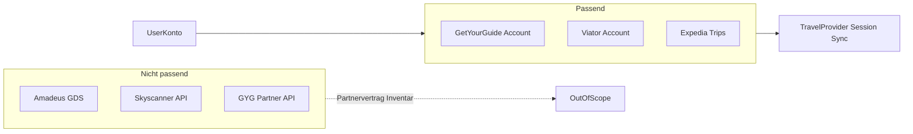
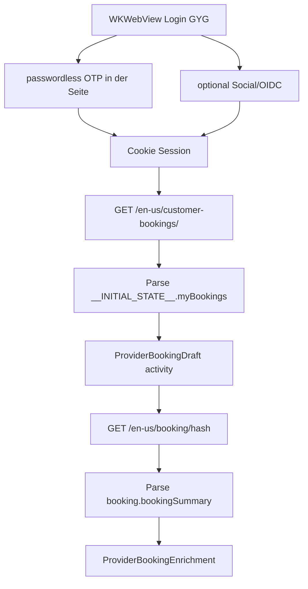
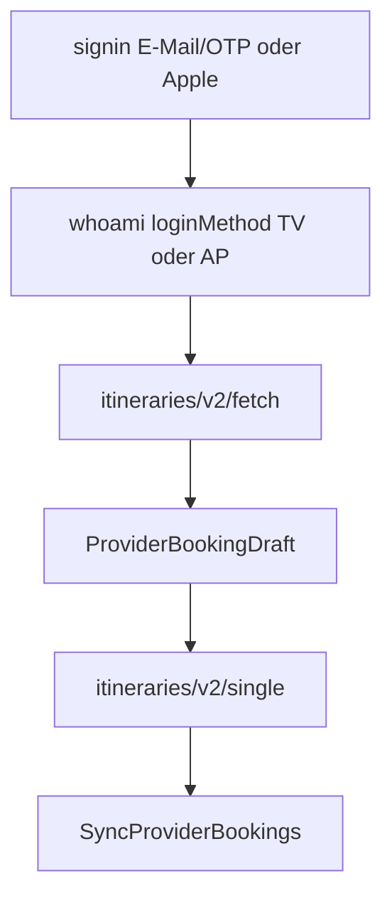

# API-Recherche: Provider-Kandidaten & Sync-Lücken (August 2026)

Zweck: Consumer-Account-Sync („Meine Buchungen“) für Reisen bewerten — analog zu
[`API_Research_Opodo_Booking.md`](API_Research_Opodo_Booking.md).  
Partner-/Demand-APIs (Amadeus, Sabre, GYG Partner, Expedia Lodging Supply) bleiben **out of scope**.

**HAR-Quellen (lokal, gitignored):** `HAR/*.har`  
**Redigierte Fixtures:** [`fixtures/provider-research/`](fixtures/provider-research/) (keine Tokens/PII)

### Spec-Index (Umsetzung nach Freigabe)

| Spec | Inhalt |
|------|--------|
| [`dev/provider-activity-implementation-plan.md`](dev/provider-activity-implementation-plan.md) | **Ausführungsreihenfolge** Phase 0–2 (+ Phase 3+) |
| [`dev/booking-type-activity-impl-spec.md`](dev/booking-type-activity-impl-spec.md) | Gemeinsame Basis `BookingType.activity` |
| [`dev/airbnb-experiences-impl-spec.md`](dev/airbnb-experiences-impl-spec.md) | Airbnb Catalog + `activity_reservation_details` |
| [`dev/getyourguide-impl-spec.md`](dev/getyourguide-impl-spec.md) | Neuer Provider GYG |
| [`dev/billiger-mietwagen-impl-spec.md`](dev/billiger-mietwagen-impl-spec.md) | Neuer Provider billiger-mietwagen.de (FLOYT) |
| [`dev/check24-productkey-audit.md`](dev/check24-productkey-audit.md) | productKey-Inventory + Live-Audit-Checkliste |
| [`dev/bookingcom-mytrips-audit.md`](dev/bookingcom-mytrips-audit.md) | Booking.com `verticalType` / Reservation-`__typename` + Query-Shape 2026-08 |

Ausführungsdetails nur im Plan — nicht hier wiederholen.

---

## Architektur-Rahmen

| Modell | Beispiele | Passt zu Reisen? |
|--------|-----------|------------------|
| Consumer-Account-Sync | Check24 Kundenbereich, Booking My Trips, Airbnb Trips, **GetYourGuide customer-bookings** | **Ja** |
| Partner/Metasearch-API | Amadeus, Skyscanner Travel API, GYG Partner API, Expedia Lodging Supply | **Nein** |
| Gap-Deep-Links | Check24 Hotel/Flug-Suche | Teilweise (nur Suche, kein Sync) |

Neue Provider = [`TravelProvider`](../Sources/ReisenDomain/Ports/TravelProvider.swift) + `WKWebView`-Session, wie die registrierten Sync-Anbieter (Check24, Opodo, Booking.com, Airbnb, GetYourGuide, Traveloka, billiger-mietwagen.de).

---

## Priorisierte Kandidaten

### Prio 1 – Erlebnisse / Activities

| Provider | Sync-Pfad | Aufwand | Status Recherche |
|----------|-----------|---------|------------------|
| **Airbnb Experiences** | `TripListQuery` + `activity_reservation_details` | Niedrig | HAR ausgewertet; [Impl-Spec](dev/airbnb-experiences-impl-spec.md) |
| **GetYourGuide** | SSR `__INITIAL_STATE__` auf `/customer-bookings/` + `/booking/{hash}` | Niedrig–mittel | HAR ausgewertet; [Impl-Spec](dev/getyourguide-impl-spec.md) |
| **Traveloka** | Cookie-Session + `tripitinerary` fetch/single; Login E-Mail/OTP + Sign in with Apple | Mittel | HAR ausgewertet; [Impl-Spec](dev/traveloka-impl-spec.md) |
| Expedia / TripAdvisor | Account-Portal | Hoch | Auth/Captcha; siehe unten |
| Viator | Session/Login | Mittel–hoch | noch ohne HAR |
| TUI Musement | myTUI / Musement | Mittel | noch ohne HAR |

Domain-Basis: [`BookingType.activity`](dev/booking-type-activity-impl-spec.md). Reihenfolge: [Ausführungsplan](dev/provider-activity-implementation-plan.md).

### Prio 2 – Meta-OTA

| Provider | Hinweis | Status |
|----------|---------|--------|
| **Expedia Trips** (+ Hotels.com) | Consumer-Konto „Trips/Bookings“, nicht Lodging Supply GraphQL | [Bewertung](#expedia-trips--session-sync-bewertung) |
| HolidayCheck / weg.de / Ab-in-den-Urlaub | DE-Pauschal; HTML-lastig | nachrangig |

**Nicht als Sync:** Skyscanner, Kayak, Google Flights (Metasuche) — ggf. Gap-Deep-Links.

### Prio 3 – Transport (optional)

| Provider | Sync-Pfad | Aufwand | Status Recherche |
|----------|-----------|---------|------------------|
| **billiger-mietwagen.de** (FLOYT) | Session.php + `consumer-api.floyt.com` bookings | Mittel | Live-Capture 2026-08-28; [Impl-Spec](dev/billiger-mietwagen-impl-spec.md) |
| FlixBus/DB, Sixt | — | — | nachrangig; ggf. Check24-`productKey`-Whitelist |

---

## Teil A.4 – billiger-mietwagen.de / FLOYT

**HAR-SSOT** (Surfaces). **Mapping-SSOT:** [`billiger-mietwagen-impl-spec.md`](dev/billiger-mietwagen-impl-spec.md).

**Quelle:** Live authenticated fetch 2026-08-28 (FLOYT SPA unter `/reservation/`); Roh-HAR optional unter `HAR/billiger-mietwagen_*.har` (gitignored).  
**Fixtures:** `bm_bookings_active_redacted.json`, `bm_bookings_inactive_redacted.json`, `bm_booking_detail_web_redacted.json`, `bm_session_*_redacted.json`.

### Surfaces

| Rolle | URL / Endpoint | Inhalt |
|-------|----------------|--------|
| Login-UI | `GET …/reservation/account/login` | E-Mail/Passwort + Social (Apple/Google) |
| Buchungsliste-UI | `GET …/reservation/account/bookings` | SPA; braucht JS |
| Login API | `POST https://consumer-api.floyt.com/auth/v1/login` | Body `username`/`password`; Header `X-Whitelabel: DE_billiger-mietwagen` → Tokens inkl. `id_token` |
| Session schreiben | `POST …/user_account/session.php` | Body `access_token`+`refresh_token`; Cookies `__Secure-billigermietwagen`, `__Secure-user_account` |
| Session lesen | `GET …/user_account/session.php` | Tokens für Sync/Probe |
| Token-Refresh | `POST …/auth/v1/refresh-token` | Body `{refresh_token,user_id}` mit `user_id`=JWT-`username` (nicht `sub`); 201 oft nur `access_token`+`id_token` (Refresh nicht rotiert) |
| Catalog active | `GET …/useraccount/v1/bookings?activity_status=active&…` | Upcoming |
| Catalog inactive | `GET …/bookings?activity_status=inactive&sort_by=DropOffDate&…` | Past/storniert (SPA-Parität) |
| Detail | `GET …/useraccount/v1/web/bookings/{id}` | Web-Detail (länger als Non-Web) |
| Settings | `GET https://api.billiger-mietwagen.de/v1/site/settings` | Locale, Social-Client-IDs |
| Deep-Link UI | `GET …/reservation/account/bookings/{uuid}` | Buchungsdetails-SPA |

**Hosts:** `e` = `www.billiger-mietwagen.de`, `t` = `api.billiger-mietwagen.de`, `n` = `consumer-api.floyt.com` (URL-Map in SPA `iframe-connector`).

**Kernbefund:** Ein Primärpfad Cookie → session.php → **Refresh** → Bearer JSON (active+inactive). `/reservation/account/` ohne Suffix → SPA-404; Login und Bookings sind getrennte Pfade (Heuristik ok; Homepage → Session-Probe).

**Auth-Header:** Live-HAR Login nutzt `X-Whitelabel: DE_billiger-mietwagen`, `client-id: web`, `Origin: https://www.billiger-mietwagen.de`. Session-POST sendet `client-id` + `Origin`. **Kein** CSRF/XSRF-Header — Cookies + Bearer + diese SPA-Header. Session-`access_token` allein oft **401** an Consumer-API → Refresh Pflicht (gleiche Header wie Login-API).

**Cookie-Banner:** Consent-Banner muss im WKWebView vom Nutzer geschlossen werden; sonst Login/Sync blockiert. Kein Auto-Dismiss in der App.

**Browser-Verifikation 2026-08-28:** Deep-Link + Web-Detail OK; Testkonto nur inactive/storniert → Domain droppt Drafts (0 syncbare Upcoming).

### Offene Punkte

- Safari-HAR-Datei optional nachziehen (WebKit-Parität; JSON-Shape und Login-HAR bereits belegt; Capture-SSOT ergänzen)
- Pagination `pointers.next` für >10 Buchungen pro Status (Sync lädt alle Seiten)
- Manueller Live-Sync in App-WebView (Cookie-Banner → Login → eine aktive Buchung) als Abnahme

---

## Teil A.1 – GetYourGuide HAR-Befunde

**HAR-SSOT** (Surfaces, Feldinventar, offene Punkte).  
**Mapping-SSOT:** [`getyourguide-impl-spec.md`](dev/getyourguide-impl-spec.md).

**Quellen:**  
- `HAR/www.getyourguide.com_Archive [26-08-03 17-26-52].har` (532 Entries) — Surfaces/Feldinventar.  
- `HAR/www.getyourguide.com_Archive [26-08-28 10-02-09].har` (585 Entries, Firefox, eingeloggte Session) — Pagination + Cloudflare.  
- `HAR/www.getyourguide.com_Archive [26-08-28 10-18-20].har` (54 Entries, Firefox) — E-Mail-Login (passwordless OTP, ohne Social).  
**Fixtures:** `gyg_myBookings_redacted.json`, `gyg_myBookings_ssr_lists_redacted.json`, `gyg_bookingSummary_redacted.json`.

### Surfaces

| Rolle | URL / Endpoint | Inhalt |
|-------|----------------|--------|
| Katalog (SSR) | `GET …/{locale}/customer-bookings/` — HAR `de-de`, Sync-Impl `en-us` | HTML mit `window.__INITIAL_STATE__.myBookings` |
| Detail (SSR) | `GET …/{locale}/booking/{bookingHash}` — HAR `de-de`, Sync-Impl `en-us` | HTML mit `booking.bookingSummary` |
| Auth Token (Social) | `POST /auth/social/exchange` | Bearer + claims — **nicht** persistieren |
| Auth OTP senden | `POST /auth/passwordless/otp/send` | Body `{email}` → `200` Text `OK` |
| Auth OTP tauschen | `POST /auth/passwordless/otp/exchange` | 6-stelliger OTP → `accessToken` + claims; setzt Cookies — **nicht** persistieren |
| Letzte Login-Methode | `POST travelers-api…/customer/action/v1/last-login-method` | Body `{email}` → `{last_sign_in_method}` (hier leer) |
| Session Nachlauf | `POST travelers-api…/customer/management/v1/post-login` | nach Login (Social und E-Mail) |
| Profil | `GET travelers-api…/customers/{id}` | Stammdaten — Sync nicht nötig |
| GraphQL | `POST travelers-api…/graphql` | nur `GetWishlistsSummary` — **nicht** Buchungsliste |
| QR/Voucher | `travelers-api…/barcode/qrcode?code=…` | in Detail referenziert |
| Tracking | Observer PageRequests | irrelevant |

**Kernbefund:** Liste + Details kommen als SSR-JSON in `__INITIAL_STATE__`, nicht über eine dedizierte Bookings-GraphQL-Query.

### Katalog-Felder (`myBookings`)

- Listen: `upcomingBookings`, `pastBookings` (HAR: Status `active` / `cancelled` / `done`)
- IDs: `bookingId`, `bookingHash`, `bookingReference`, `activityId`, `activityOptionId`
- Zeit: `startingTime.startTime` (ISO+Offset), `bookingFinishDate`
- Preis: `price.amount` / `price.currencyIsoCode`
- Titel/Ort: `bookedOption.activityTitle`, `activityOptionTitle`, `activityLocation.city/country`
- Typ: `activityType` (`dayTrip`, `multiDayTrip`, `guidedTour`, …)
- Teilnehmer: `activityParticipants[]`
- Storno: `bookingCancellationPolicy` (`type`, `message`, `expirationDate` / `policyExpirationDate`)

Catalog allein reicht für sinnvolle Drafts; Enrichment für Treffpunkt, Itinerary, feinere Policy.  
Feld→Domain-Mapping: [GYG Impl-Spec](dev/getyourguide-impl-spec.md).

Live-Shape 2026-08-28: `myBookings`-Keys nur `upcomingBookings`, `pastBookings`, `customerEmail`, `isCustomerEmailValidated` — **keine** `page`/`offset`/`cursor`/`hasMore`. In dieser Session 0 upcoming, 4 past (GYG legt beendete Termine nach `pastBookings`, auch mit Status `active`). Catalog-Parser mappt **beide** Listen über `DraftAssembler.draft` (Dedup `dedupedByExternalURL`); `CatalogListing.shouldDrop` sowie Einträge ohne Hash/Ende werden übersprungen.

### Pagination (2026-08-28, geschlossen)

Auf `/customer-bookings/` feuern **keine** Listen-Pagination-Requests.

- Zwei identische `GET /de-de/customer-bookings/` (Liste → Detail → Liste → Detail), gleicher SSR-Body.
- Page-Chunk `my-bookings-*.js` rendert nur `state.upcomingBookings` / `state.pastBookings`; SSR-Prefetch `myBookings/loadDefaultState`; Mount holt höchstens `reviews/submission-details` und Profil. Kein `loadMore`, kein `pageSize`.
- Kein `GET travelers-api…/customers/{id}/bookings`, kein `/upcoming-bookings.json` (Routen existieren im Frontend-Registry, werden auf dieser Seite nicht aufgerufen).
- GraphQL unverändert nur Wishlists.

**Sync:** ein authentifizierter HTML-GET, keine Page-Schleife.

### Cloudflare (Cursor-Tab + HAR 2026-08-28, geschlossen)

Kein Challenge/Turnstile in den beobachteten Sessions.

- Cursor-Tab: Login-HTML ohne Interstitial; nur Cloudflare-Insights-Beacon (`static.cloudflareinsights.com`) plus Usercentrics-Cookie-Banner.
- Firefox-HAR: `server: cloudflare`, `cf-ray`, `cf-cache-status: DYNAMIC` auf www/cdn/`travelers-api`; **`cf-mitigated` nie gesetzt**; 0 Challenge-Bodies. Katalog- und Detail-HTML 200.
- Forter-Scripts sind Fraud/Device, kein CF-Interstitial.

WebView-Pfad bleibt korrekt. Eine spätere Challenge (200 oder 403) mit Challenge-Body → `cloudflareChallenge`, kein stiller Fallback und kein „bitte anmelden“.

### Login ohne Social (2026-08-28, geschlossen)

Passwordless E-Mail-OTP, kein Passwort-Feld, kein `POST /auth/social/exchange`. Capture startet auf der Homepage; Login-UI ist SPA (`otp-centric-login-wrapper-*.js`), daher keine HTML-Navigation auf `/login` in dieser HAR.

| Schritt | Request | Body-Shape (keine Werte) | Response |
|--------|---------|--------------------------|----------|
| 1 | `POST travelers-api.getyourguide.com/customer/action/v1/last-login-method` | `{email}` | `{last_sign_in_method: ""}` (leer in dieser Session) |
| 2 | `POST www.getyourguide.com/auth/passwordless/otp/send` | `{email}` | `200` `text/plain` **`OK`** |
| 3 | Nutzer: 6-stelliger OTP | | |
| 4 | `POST www.getyourguide.com/auth/passwordless/otp/exchange` | `email`, `otp` (Länge 6), `firstName`, `lastName`, `signupMethod`: **`pre_payment_otp`**, Newsletter-Flags, `locale`: `de-DE`, `visitorId` | JSON `accessToken` + `claims` (`gyg/auth_provider`: **`email`**, `gyg/email_verified`, `expiresAt`, …) |
| 5 | `POST travelers-api…/customer/management/v1/post-login` | Newsletter/Locale | `200` leer; `Authorization: Bearer` aus Exchange |

Session-Cookies nach `otp/exchange` (HttpOnly + Secure + SameSite): `tfe_access_token`, `tfe_authenticated_session`. `post-login` setzt `__cf_bm`. Cloudflare nur CDN (`cf-mitigated` nie).

**Sync bleibt Cookie-`WKWebView`.** Native Calls von `otp/send` / `otp/exchange` sind nicht vorgesehen. Access-Token, OTP und E-Mail weder persistieren noch loggen. App-Login-URL ist `/login?next=/de-de/customer-bookings/` (OTP-Autofill + E-Mail-Fill). Catalog `/customer-bookings/` ist Account, nicht Login. Autofill klickt nach E-Mail-Fill keinen Social-/IdP-Button (Apple/Google/Facebook). Catalog-200 ohne `myBookings`/`bookingSummary` in `__INITIAL_STATE__` gilt als fehlende Session; ein leeres `myBookings`-Objekt ist eingeloggt (leerer Katalog).

### Offene Punkte (HAR)

- Dedizierte JSON-Bookings-API (Mobil) — Web-SSR braucht sie nicht; Registry-Routen ohne Live-Call

---

## Teil A.2 – Airbnb Experiences HAR-Befunde

**HAR-SSOT** (Surfaces, Katalog-Probleme, Code-vs-Soll).  
**Mapping-SSOT:** [`airbnb-experiences-impl-spec.md`](dev/airbnb-experiences-impl-spec.md).

**Quelle:** `HAR/www.airbnb.com.sg_Archive [26-08-03 17-47-22].har` (758 Entries).  
**Fixtures:** `airbnb_TripListQuery_experience_redacted.json`, `airbnb_activity_reservation_details_redacted.json`.

### Surfaces

| Rolle | Endpoint | HAR |
|-------|----------|-----|
| Katalog | `GET /api/v3/TripListQuery/…?operationName=TripListQuery` | Experience-Trip |
| Detail | `GET /api/v2/activity_reservation_details/EXPERIENCE_RESERVATION/{code}` | Rows-JSON |
| Nicht in dieser HAR | `TripDetailsQuery`, `/api/v2/scheduled_events/…` | im **bestehenden Code** für Stay-Enrichment |

### Katalog-Probleme (HAR bestätigt)

1. Titel = Trip-`displayName` (Ort), nicht Experience-Name → UX schlecht bis Enrichment
2. Code mappt Experiences → `.other` statt `.activity` ([`AirbnbTripsGraphQLParser`](../Sources/ReisenAirbnb/AirbnbTripsGraphQLParser.swift))
3. Gäste aus `travelerCapacity` vorhanden; Enrichment setzt Experiences bewusst auf `nil`

### Abgleich Code vs. Soll

| Aspekt | Code heute | Soll |
|--------|------------|------|
| Experience-Endpoint | `scheduled_events` + `TripDetailsQuery` | Primär **`activity_reservation_details`** |
| Titel | Trip `displayName` | Marquee-`title` |
| Typ | `.other` | `.activity` |
| Gäste | `nil` für Experiences | `travelerCapacity` / `guest_count` |

Row-`id`→Feld-Mapping: [Airbnb Impl-Spec § Neuer Parser](dev/airbnb-experiences-impl-spec.md#neuer-parser).

---

## Teil A.3 – Opodo HAR + Implement-Verdict

**Quelle:** `HAR/www.opodo.de_Archive [26-08-03 17-40-03].har` (~3784 Entries).  
**Fixture (Research):** `opodo_getTrips_upcoming_redacted.json`  
**Parser-Fixture (bestehend):** [`Tests/ReisenOpodoTests/Fixtures/getTrips_upcoming.json`](../Tests/ReisenOpodoTests/Fixtures/getTrips_upcoming.json)

### Kataloginhalt `getTrips(UPCOMING)`

| # | Typ | Inhalt |
|---|-----|--------|
| 1 | Flug | SIN→CGK, `transportTypes: [PLANE]`, Preis |
| 2–4 | Hotel | Unterkünfte, Board, Check-in/out |

`getTrips(PAST)` (Live 2026-08-28, Konto-Beleg): 5 Rows — 2× `PLANE`, 3× Hotel (davon RETAINED). **Keine** gebuchten Mietwagen, Transfers, Bahn, Activities. `vehicleBooking` ist kein Trip-Feld. `insuranceBookings` hängt als Ancillary am Trip, wird nicht abgefragt.

### Bereits im Code

Flug/Hotel über `getTrips` / `getTripByToken` / Support-Area Passengers+Baggage. HTML-Fallback nur bei **leerer** GraphQL-Liste (nicht bei GraphQL-Fehler). Upsell-Rows und Nicht-`PLANE`-Itineraries werden verworfen.

### Nicht syncen

| Signal | Bedeutung |
|--------|-----------|
| `GetVehicleRentalOffers*` / `VR_getTransferOffers*` | Upsell, keine Buchungen |
| FastTrack / Seat / Cabin-Bag Queries | Post-Booking-Verkauf |
| `insuranceBookings` | Ancillary — kein eigener Typ ohne Domain-Entscheidung |

### Epoch vs `departureDateISO8601`

- Section: Epoch als Pseudo-UTC-Wall-Clock + parallel `departureDateISO8601` mit Offset.
- Passt zu [`FlightTimeZoneAssigner`](../Sources/ReisenAppCore/FlightTimeZoneAssigner.swift) (`forWallClockInstant`).
- Blind auf ISO-Absolute umstellen **ohne** Offset-Pipeline → Zeiten kaputt.
- `arrivalDateISO8601` in HAR-Response fehlend → asymmetrisches Upgrade riskant.

### Implement-Verdict

**Katalog-Vertrag (Live 2026-08-28 + HAR):** nur Flug/Hotel; Upsell ignorieren; HTML nur wenn GraphQL leer.

- Neue Buchungstypen: **nein**
- `getTrips(UPCOMING)` kann leer sein, während PAST Flug/Hotel enthält — Katalog bleibt UPCOMING
- Optional später (separat spezifizieren): Departure-Offset aus ISO — nur mit Wall-Clock-Tests

---

## Teil A.4 – Traveloka HAR-Befunde

**HAR-SSOT** (Surfaces, Product-Types, Login TV+AP).  
**Mapping-SSOT:** [`traveloka-impl-spec.md`](dev/traveloka-impl-spec.md).

**Quelle:** `HAR/www.traveloka.com_Archive [26-08-25 17-53-21].har` (gitignored).  
**Fixtures:** `traveloka_itineraries_fetch_redacted.json`, `traveloka_itinerary_single_{hotel,experience,vehicle,flight,flight_fee}_redacted.json`, `traveloka_whoami_*.json`, `traveloka_transactions_number_redacted.json`.

### Surfaces

| Rolle | URL / Endpoint | Inhalt |
|-------|----------------|--------|
| Login | `GET …/en-en/user/signin?referrer=…/mybooking` | E-Mail/OTP + Sign in with Apple / Google / Facebook |
| Session-Probe | `POST /api/v2/user/whoami` | `loginMethod` ∈ {`TV`,`AP`,…}; `revoked` |
| Catalog | `POST /api/v2/tripitinerary/itineraries/v2/fetch` | `itineraryEntryList` (Gruppen ACTIVE_BOOKING) |
| Enrich | `POST /api/v2/tripitinerary/itineraries/v2/single` | `cardSummaryInfo` + `cardDetailInfo` |
| Optional Count | `POST …/transactions/number` | Badge-Zahlen — Sync nicht nötig |
| Detail-Deep-Link | `/en-en/item/details/{bookingId}?type={PRODUCT}&id={itineraryId}` | `externalUrl` |

**Pflicht-Header (Trip-Itinerary):** `x-domain: tripItinerary`, `x-client-interface: desktop`, `x-route-prefix: en-en`, `tv-language` / `tv-country` / `tv-currency`.

### Product-Type → Domain

| Traveloka | Domain |
|-----------|--------|
| `FLIGHT` | `.flight` |
| `HOTEL` (Villa/Apartment-Heuristik) | `.hotel` |
| `EXPERIENCE` | `.activity` |
| `VEHICLE_RENTAL` | `.carRental` |
| `TRAIN` / `TRAIN_GLOBAL` | `.train` (Typ-Mapping; **nicht** in Catalog-`itineraryTypes` — Live 2026-08-28 leere Liste) |
| Airport Transport, Ancillary, Insurance, unbekannt | `.other` |

### Feldinventar (Kurz)

- **Hotel:** dual Free+Fee-`cancellationPolicies`; Check-in/out Minuten; `hotelOffsetSeconds` aus `ianaTimezoneBegin`; Stay-Hints aus `importantNoticePolicies` / `propertyPolicy` (Live 2026-08-28); keine Pet-/Linen-Felder in diesem Konto
- **Experience:** `operatorInfo.name` → `operatorName`; All-Day → `isAllDay`; `travelersInfo` / `experiencePaxType` → `travellerType`; Policy-Strings für Free-Deadline
- **Vehicle:** `providerName` → `operatorName`; Pick-up/Drop-off Adressen; Free-Cancel-Local
- **Flight:** Live-E-Ticket `flightBookingInfo.bookingDetail` + `flightTicketInfo`; Non-Refundable ohne Deadline; Fee-Refund nur mit `refundFeeAmount` + `refundDeadlineLocal` (keine Free-Deadline erfinden)
- **Train:** Stub (`productName` + IANA-Offsets); Stations-Keys ohne Live-`single` nicht geraten

### Login (TV + AP)

1. E-Mail → MFA (`getotpinfo` / `sendotp` / `verifymfa`) → Cookies → `whoami` (`TV`)
2. Apple-Button im WKWebView → `appleid.apple.com` → `signinexternalaccount` (`AP`) — **kein** natives `ASAuthorization`
3. Autofill nur auf `*.traveloka.com`; IdP-Hosts nicht `sessionReady`

### Offene Punkte / Gap-Status (Stand Live 2026-08-28)

| Gap | Status |
|-----|--------|
| Fee-Refund-Flug Live-Shape | **Rest** — Konto ohne Fee-Flug; Fixture weiter synthetisch/schema-aligned |
| TRAIN Catalog+Stations | **Konto hat Vertical nicht** (UPCOMING 200 leer); Catalog-Types unverändert; Stations-Parser Rest |
| Product-Type-Heuristik Villa/Car | Unverändert; Unit-Tests für `VILLA`/`APARTMENT`/`CAR_RENTAL`; Live-Enums nicht gesehen |
| Pre-Travel Stay-Hints | **gefüllt** via Mapper + Traveloka-Enrichment bei leeren Hotel-`guestHints` (Catalog oft ohne Policies); Pets/Linen Rest („Petunjuk“ ≠ pet) |
| `PAST` Catalog-Status | API 400 — Code nutzt nur `UPCOMING` |

---

## Teil B – Bestehende Provider

### Check24 – productKey-Audit

SSOT (Keys, Hypothesen, Live-Checkliste): [`check24-productkey-audit.md`](dev/check24-productkey-audit.md).  
Kurz: Live-GET `/kb/api/activities` 2026-08-28 — 11 Keys inkl. `rentalcar` → `.carRental`; HTML-Detail-Parser (`CpInitial`) angebunden.

### Booking.com

SSOT: [`bookingcom-mytrips-audit.md`](dev/bookingcom-mytrips-audit.md).  
Live 2026-08-28 (`GetTripsQuery` + `SingleTimelineQuery` V1): in **diesem Konto** `ACCOMMODATION` (47), `FLIGHT` (2), `PREBOOK_TAXI` (2).  
`AttractionReservation` / `CarReservation`: MFE-Schema vorhanden, **0 Timeline-Treffer in diesem Konto** (nicht „API existiert nicht“).  
`supportedExperiences` der V1-Query unverändert (`TAXI_ARRIVAL` inkl.); Connectors auf Live-`R`-Liste. WAF = In-Page-fetch + Challenge-Cookie.

### Airbnb / Opodo (nach HAR)

Siehe A.2 bzw. A.3 — keine zusätzlichen Teil-B-Befunde.

---

## Apple-Passkey-Browser-Audit

Status: **Live-Browser-Prüfung 2026-08-31**. Geprüft wurde jeweils der
abgemeldete Login im Cursor-Browser. Es wurden keine Apple- oder
Provider-Credentials eingegeben; der Passkey-Aufruf wurde nur bis zur
Browser-/Systemanfrage gestartet.

### Ergebnisse

| Provider | Apple-Login | Apple-OAuth-Parameter | Bewertung für `ASWebAuthenticationSession` |
|----------|-------------|-----------------------|--------------------------------------------|
| Traveloka | Ja | `response_mode=web_message`, `redirect_uri=https://www.traveloka.com`, `client_id=com.traveloka.web.production` | Nicht direkt geeignet: `web_message` benötigt das von Traveloka geöffnete Popup mit `window.opener`; zusätzlich bleibt die Session Cookie-basiert. |
| Airbnb | Ja | `response_mode=web_message`, `redirect_uri=https://www.airbnb.de/oauth_callback`, `client_id=com.airbnb.web` | Nicht direkt geeignet: gleicher `web_message`-/`window.opener`-Flow; Callback und Session gehören Airbnb. |
| GetYourGuide | Ja | `response_mode=form_post`, `redirect_uri=https://auth.getyourguide.com/login/callback`, `client_id=com.getyourguide` | Bester Kandidat für einen macOS-Spike: Standard-WebAuthn-Flow und Passkey-Option sichtbar; Callback gehört weiterhin GetYourGuide. |
| Booking.com | Ja | `response_mode=form_post`, `redirect_uri=https://account.booking.com/social/result/apple`, `client_id=com.booking.BookingApp.ServiceID` | Ebenfalls Spike-Kandidat: Standard-WebAuthn-Flow und Passkey-Option sichtbar; Callback gehört weiterhin Booking.com. |
| Check24 | Nein | — | Login bietet ausschließlich E-Mail/Mobiltelefonnummer und Check24-Sicherheitscodes; kein Apple-, Social- oder Passkey-Login. |

Bei GetYourGuide und Booking.com wurde auf der Apple-Seite die Option
„Mit dem Passkey anmelden“ angezeigt. Nach dem Start wechselte die Schaltfläche
zu „Überprüfen … Mit dem Passkey anmelden“. Der QR-Code selbst erscheint als
native Browser-/Betriebssystem-UI und nicht als HTML-Inhalt; der Cursor-Browser
kann diese UI nicht auslesen.

### App-only-Fazit

Der QR-Code ist für GetYourGuide und Booking.com grundsätzlich erreichbar,
wenn der Login in Safari, Chrome oder `ASWebAuthenticationSession` läuft.
Für Reisen fehlt jedoch bei allen getesteten Providern ein direkter
App-Callback:

- Traveloka und Airbnb verwenden `response_mode=web_message` und benötigen
  ein Provider-Popup mit `window.opener`.
- GetYourGuide und Booking.com verwenden zwar `form_post`, leiten aber auf
  Provider-Callbacks weiter. Die daraus entstehenden Browser-Cookies sind
  nicht für die Reisen-`WKWebView` verfügbar.
- Check24 bietet keinen Apple-Login an.

Eine App-interne Passkey-Unterstützung ist daher ohne Provideränderung nur als
unvollständiger Browser-Login möglich. Für einen vollständigen Sync müsste der
Provider einen App-Callback oder ein von Reisen verwendbares Authentifizierungs-
Token bereitstellen. Cookie-Import aus Safari bzw. dem Systembrowser und das
Nachbauen der Provider-OAuth-Flows sind keine unterstützten Lösungen.

---

## Expedia Trips – Session-Sync-Bewertung

### Was nicht passt

- **Expedia Group Lodging Supply GraphQL** (`api.expediagroup.com/supply/lodging/graphql`): B2B Properties/Partner — falscher Scope.

### Was passen würde

- Consumer-UI **Trips / Bookings** nach Login (`expedia.de` / `.com`, Hotels.com).
- Pfad analog Booking/Airbnb: WKWebView-Login → authenticated Trip-Liste + Detail.

### Machbarkeit (ohne eigene Expedia-HAR)

| Kriterium | Einschätzung |
|-----------|--------------|
| Scope-Fit | Hoch |
| Technische Nähe | Mittel–hoch |
| Öffentliche Consumer-JSON-API | Nein |
| Blocker | Keine HAR — Endpunkte unbekannt |
| Risiko | Bot-Schutz, Locale, Hotels.com-vs-Expedia-Session |

**Verdict:** Prio 2 nach Activity-Arbeit. Nächster Schritt: Expedia.de-HAR (Hotel + optional Flug), dann Impl-Spec. Bis dahin kein Produktivcode.

---

## Plan-Conformity / offene Blocker

| Plan-Todo | Recherche-Status | Rest |
|-----------|------------------|------|
| Spec-Doc GYG/Airbnb/Opodo | erledigt | — |
| Airbnb/GYG Impl-Specs + Activity-Basis + Ausführungsplan | erledigt | Phase 0–2 Produktivcode umgesetzt |
| Opodo Verdict „kein Muss“ | erledigt | optional TZ später |
| Expedia Bewertung | erledigt | Live-HAR fehlt |
| Check24 „alle productKeys erfassen“ | **Live-Keys** | Fixture + Audit 2026-08-28; `rentalcar` → `.carRental`; Detail-Parser angebunden |
| Redigierte Fixtures GYG/Airbnb/(Opodo) | erledigt | Check24-Keys-Fixture auf Live-Keys gehoben |
| Activity Produktivcode (Airbnb + GYG) | erledigt | Unit-Tests grün; Live-Sync manuell prüfen |

---

## Datenschutz

- Roh-HARs: JWTs/Kundendaten — **gitignored** (`HAR/`, `*.har`).
- Fixtures unter `docs/fixtures/provider-research/` sind redigiert.
- Keine Tokens/PII in Specs oder Commits.
