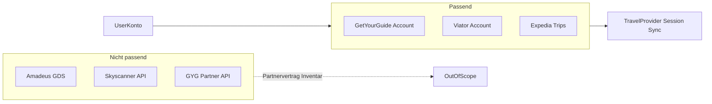
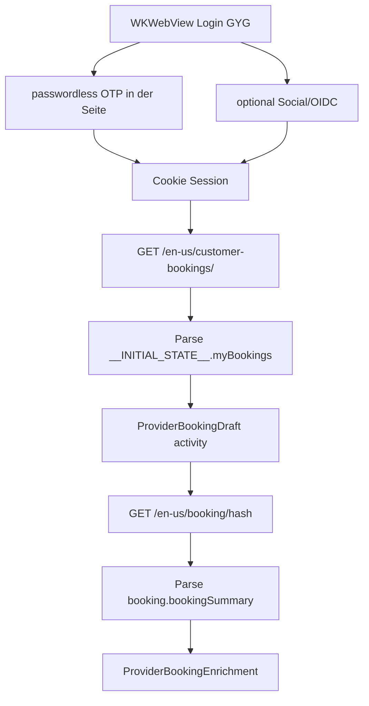
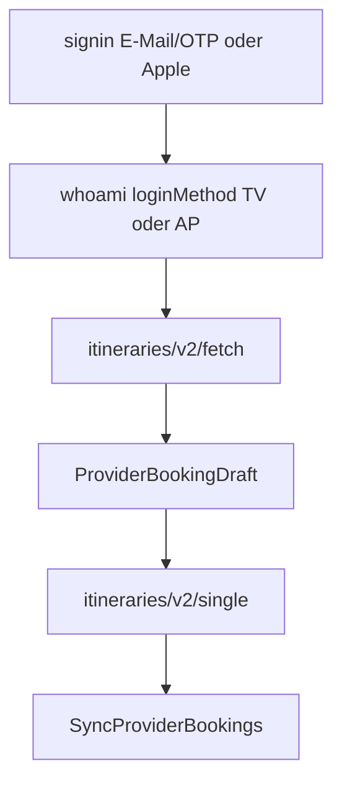

# API-Recherche: Provider-Kandidaten & Sync-Lücken (August 2026)

Zweck: Consumer-Account-Sync („Meine Buchungen“) für Reisen bewerten — analog zu
[`API_Research_Opodo_Booking.md`](API_Research_Opodo_Booking.md).  
Partner-/Demand-APIs (Amadeus, Sabre, GYG Partner, Expedia Lodging Supply) bleiben **out of scope**.

**HAR-Quellen (lokal, gitignored):** `HAR/*.har`  
**Redigierte Fixtures:** [`fixtures/provider-research/`](fixtures/provider-research/) (keine Tokens/PII)

### Spec-Index (Umsetzung nach Freigabe)

| Spec | Inhalt |
|------|--------|
| [`dev/provider-activity-implementation-plan.md`](dev/provider-activity-implementation-plan.md) | **Ausführungsreihenfolge** Phase 0–2 (+ Phase 3+) |
| [`dev/booking-type-activity-impl-spec.md`](dev/booking-type-activity-impl-spec.md) | Gemeinsame Basis `BookingType.activity` |
| [`dev/airbnb-experiences-impl-spec.md`](dev/airbnb-experiences-impl-spec.md) | Airbnb Catalog + `activity_reservation_details` |
| [`dev/getyourguide-impl-spec.md`](dev/getyourguide-impl-spec.md) | Neuer Provider GYG |
| [`dev/check24-productkey-audit.md`](dev/check24-productkey-audit.md) | productKey-Inventory + Live-Audit-Checkliste |

Ausführungsdetails nur im Plan — nicht hier wiederholen.

---

## Architektur-Rahmen

| Modell | Beispiele | Passt zu Reisen? |
|--------|-----------|------------------|
| Consumer-Account-Sync | Check24 Kundenbereich, Booking My Trips, Airbnb Trips, **GetYourGuide customer-bookings** | **Ja** |
| Partner/Metasearch-API | Amadeus, Skyscanner Travel API, GYG Partner API, Expedia Lodging Supply | **Nein** |
| Gap-Deep-Links | Check24 Hotel/Flug-Suche | Teilweise (nur Suche, kein Sync) |

Neue Provider = [`TravelProvider`](../Sources/ReisenProviders/TravelProvider.swift) + `WKWebView`-Session, wie die **sechs** registrierten Anbieter (Check24, Opodo, Booking.com, Airbnb, GetYourGuide, Traveloka).

---

## Priorisierte Kandidaten

### Prio 1 – Erlebnisse / Activities

| Provider | Sync-Pfad | Aufwand | Status Recherche |
|----------|-----------|---------|------------------|
| **Airbnb Experiences** | `TripListQuery` + `activity_reservation_details` | Niedrig | HAR ausgewertet; [Impl-Spec](dev/airbnb-experiences-impl-spec.md) |
| **GetYourGuide** | SSR `__INITIAL_STATE__` auf `/customer-bookings/` + `/booking/{hash}` | Niedrig–mittel | HAR ausgewertet; [Impl-Spec](dev/getyourguide-impl-spec.md) |
| **Traveloka** | Cookie-Session + `tripitinerary` fetch/single; Login E-Mail/OTP + Sign in with Apple | Mittel | HAR ausgewertet; [Impl-Spec](dev/traveloka-impl-spec.md) |
| Expedia / TripAdvisor | Account-Portal | Hoch | Auth/Captcha; siehe unten |
| Viator | Session/Login | Mittel–hoch | noch ohne HAR |
| TUI Musement | myTUI / Musement | Mittel | noch ohne HAR |

Domain-Basis: [`BookingType.activity`](dev/booking-type-activity-impl-spec.md). Reihenfolge: [Ausführungsplan](dev/provider-activity-implementation-plan.md).

### Prio 2 – Meta-OTA

| Provider | Hinweis | Status |
|----------|---------|--------|
| **Expedia Trips** (+ Hotels.com) | Consumer-Konto „Trips/Bookings“, nicht Lodging Supply GraphQL | [Bewertung](#expedia-trips--session-sync-bewertung) |
| HolidayCheck / weg.de / Ab-in-den-Urlaub | DE-Pauschal; HTML-lastig | nachrangig |

**Nicht als Sync:** Skyscanner, Kayak, Google Flights (Metasuche) — ggf. Gap-Deep-Links.

### Prio 3 – Transport (optional)

FlixBus/DB, Sixt — neuer Typ oder zuerst Check24-`productKey`-Whitelist (siehe [Check24](#check24--productkey-audit)).

---

## Teil A.1 – GetYourGuide HAR-Befunde

**HAR-SSOT** (Surfaces, Feldinventar, offene Punkte).  
**Mapping-SSOT:** [`getyourguide-impl-spec.md`](dev/getyourguide-impl-spec.md).

**Quellen:**  
- `HAR/www.getyourguide.com_Archive [26-08-03 17-26-52].har` (532 Entries) — Surfaces/Feldinventar.  
- `HAR/www.getyourguide.com_Archive [26-08-28 10-02-09].har` (585 Entries, Firefox, eingeloggte Session) — Pagination + Cloudflare.  
- `HAR/www.getyourguide.com_Archive [26-08-28 10-18-20].har` (54 Entries, Firefox) — E-Mail-Login (passwordless OTP, ohne Social).  
**Fixtures:** `gyg_myBookings_redacted.json`, `gyg_myBookings_ssr_lists_redacted.json`, `gyg_bookingSummary_redacted.json`.

### Surfaces

| Rolle | URL / Endpoint | Inhalt |
|-------|----------------|--------|
| Katalog (SSR) | `GET …/{locale}/customer-bookings/` — HAR `de-de`, Sync-Impl `en-us` | HTML mit `window.__INITIAL_STATE__.myBookings` |
| Detail (SSR) | `GET …/{locale}/booking/{bookingHash}` — HAR `de-de`, Sync-Impl `en-us` | HTML mit `booking.bookingSummary` |
| Auth Token (Social) | `POST /auth/social/exchange` | Bearer + claims — **nicht** persistieren |
| Auth OTP senden | `POST /auth/passwordless/otp/send` | Body `{email}` → `200` Text `OK` |
| Auth OTP tauschen | `POST /auth/passwordless/otp/exchange` | 6-stelliger OTP → `accessToken` + claims; setzt Cookies — **nicht** persistieren |
| Letzte Login-Methode | `POST travelers-api…/customer/action/v1/last-login-method` | Body `{email}` → `{last_sign_in_method}` (hier leer) |
| Session Nachlauf | `POST travelers-api…/customer/management/v1/post-login` | nach Login (Social und E-Mail) |
| Profil | `GET travelers-api…/customers/{id}` | Stammdaten — Sync nicht nötig |
| GraphQL | `POST travelers-api…/graphql` | nur `GetWishlistsSummary` — **nicht** Buchungsliste |
| QR/Voucher | `travelers-api…/barcode/qrcode?code=…` | in Detail referenziert |
| Tracking | Observer PageRequests | irrelevant |

**Kernbefund:** Liste + Details kommen als SSR-JSON in `__INITIAL_STATE__`, nicht über eine dedizierte Bookings-GraphQL-Query.

### Katalog-Felder (`myBookings`)

- Listen: `upcomingBookings`, `pastBookings` (HAR: Status `active` / `cancelled` / `done`)
- IDs: `bookingId`, `bookingHash`, `bookingReference`, `activityId`, `activityOptionId`
- Zeit: `startingTime.startTime` (ISO+Offset), `bookingFinishDate`
- Preis: `price.amount` / `price.currencyIsoCode`
- Titel/Ort: `bookedOption.activityTitle`, `activityOptionTitle`, `activityLocation.city/country`
- Typ: `activityType` (`dayTrip`, `multiDayTrip`, `guidedTour`, …)
- Teilnehmer: `activityParticipants[]`
- Storno: `bookingCancellationPolicy` (`type`, `message`, `expirationDate` / `policyExpirationDate`)

Catalog allein reicht für sinnvolle Drafts; Enrichment für Treffpunkt, Itinerary, feinere Policy.  
Feld→Domain-Mapping: [GYG Impl-Spec](dev/getyourguide-impl-spec.md).

Live-Shape 2026-08-28: `myBookings`-Keys nur `upcomingBookings`, `pastBookings`, `customerEmail`, `isCustomerEmailValidated` — **keine** `page`/`offset`/`cursor`/`hasMore`. In dieser Session 0 upcoming, 4 past (GYG legt beendete Termine nach `pastBookings`, auch mit Status `active`). Catalog-Parser mappt **beide** Listen (Dedup per Hash); `done` und Einträge ohne Hash/Ende werden übersprungen.

### Pagination (2026-08-28, geschlossen)

Auf `/customer-bookings/` feuern **keine** Listen-Pagination-Requests.

- Zwei identische `GET /de-de/customer-bookings/` (Liste → Detail → Liste → Detail), gleicher SSR-Body.
- Page-Chunk `my-bookings-*.js` rendert nur `state.upcomingBookings` / `state.pastBookings`; SSR-Prefetch `myBookings/loadDefaultState`; Mount holt höchstens `reviews/submission-details` und Profil. Kein `loadMore`, kein `pageSize`.
- Kein `GET travelers-api…/customers/{id}/bookings`, kein `/upcoming-bookings.json` (Routen existieren im Frontend-Registry, werden auf dieser Seite nicht aufgerufen).
- GraphQL unverändert nur Wishlists.

**Sync:** ein authentifizierter HTML-GET, keine Page-Schleife.

### Cloudflare (Cursor-Tab + HAR 2026-08-28, geschlossen)

Kein Challenge/Turnstile in den beobachteten Sessions.

- Cursor-Tab: Login-HTML ohne Interstitial; nur Cloudflare-Insights-Beacon (`static.cloudflareinsights.com`) plus Usercentrics-Cookie-Banner.
- Firefox-HAR: `server: cloudflare`, `cf-ray`, `cf-cache-status: DYNAMIC` auf www/cdn/`travelers-api`; **`cf-mitigated` nie gesetzt**; 0 Challenge-Bodies. Katalog- und Detail-HTML 200.
- Forter-Scripts sind Fraud/Device, kein CF-Interstitial.

WebView-Pfad bleibt korrekt. Eine spätere Challenge (200 oder 403) mit Challenge-Body → `cloudflareChallenge`, kein stiller Fallback und kein „bitte anmelden“.

### Login ohne Social (2026-08-28, geschlossen)

Passwordless E-Mail-OTP, kein Passwort-Feld, kein `POST /auth/social/exchange`. Capture startet auf der Homepage; Login-UI ist SPA (`otp-centric-login-wrapper-*.js`), daher keine HTML-Navigation auf `/login` in dieser HAR.

| Schritt | Request | Body-Shape (keine Werte) | Response |
|--------|---------|--------------------------|----------|
| 1 | `POST travelers-api.getyourguide.com/customer/action/v1/last-login-method` | `{email}` | `{last_sign_in_method: ""}` (leer in dieser Session) |
| 2 | `POST www.getyourguide.com/auth/passwordless/otp/send` | `{email}` | `200` `text/plain` **`OK`** |
| 3 | Nutzer: 6-stelliger OTP | | |
| 4 | `POST www.getyourguide.com/auth/passwordless/otp/exchange` | `email`, `otp` (Länge 6), `firstName`, `lastName`, `signupMethod`: **`pre_payment_otp`**, Newsletter-Flags, `locale`: `de-DE`, `visitorId` | JSON `accessToken` + `claims` (`gyg/auth_provider`: **`email`**, `gyg/email_verified`, `expiresAt`, …) |
| 5 | `POST travelers-api…/customer/management/v1/post-login` | Newsletter/Locale | `200` leer; `Authorization: Bearer` aus Exchange |

Session-Cookies nach `otp/exchange` (HttpOnly + Secure + SameSite): `tfe_access_token`, `tfe_authenticated_session`. `post-login` setzt `__cf_bm`. Cloudflare nur CDN (`cf-mitigated` nie).

**Sync bleibt Cookie-`WKWebView`.** Native Calls von `otp/send` / `otp/exchange` sind nicht vorgesehen. Access-Token, OTP und E-Mail weder persistieren noch loggen. App-Login-URL ist `/login?next=/de-de/customer-bookings/` (OTP-Autofill + E-Mail-Fill). Catalog `/customer-bookings/` ist Account, nicht Login. Autofill klickt nach E-Mail-Fill keinen Social-/IdP-Button (Apple/Google/Facebook). Catalog-200 ohne `myBookings`/`bookingSummary` in `__INITIAL_STATE__` gilt als fehlende Session; ein leeres `myBookings`-Objekt ist eingeloggt (leerer Katalog).

### Offene Punkte (HAR)

- Dedizierte JSON-Bookings-API (Mobil) — Web-SSR braucht sie nicht; Registry-Routen ohne Live-Call

---

## Teil A.2 – Airbnb Experiences HAR-Befunde

**HAR-SSOT** (Surfaces, Katalog-Probleme, Code-vs-Soll).  
**Mapping-SSOT:** [`airbnb-experiences-impl-spec.md`](dev/airbnb-experiences-impl-spec.md).

**Quelle:** `HAR/www.airbnb.com.sg_Archive [26-08-03 17-47-22].har` (758 Entries).  
**Fixtures:** `airbnb_TripListQuery_experience_redacted.json`, `airbnb_activity_reservation_details_redacted.json`.

### Surfaces

| Rolle | Endpoint | HAR |
|-------|----------|-----|
| Katalog | `GET /api/v3/TripListQuery/…?operationName=TripListQuery` | Experience-Trip |
| Detail | `GET /api/v2/activity_reservation_details/EXPERIENCE_RESERVATION/{code}` | Rows-JSON |
| Nicht in dieser HAR | `TripDetailsQuery`, `/api/v2/scheduled_events/…` | im **bestehenden Code** für Stay-Enrichment |

### Katalog-Probleme (HAR bestätigt)

1. Titel = Trip-`displayName` (Ort), nicht Experience-Name → UX schlecht bis Enrichment
2. Code mappt Experiences → `.other` statt `.activity` ([`AirbnbTripsGraphQLParser`](../Sources/ReisenAirbnb/AirbnbTripsGraphQLParser.swift))
3. Gäste aus `travelerCapacity` vorhanden; Enrichment setzt Experiences bewusst auf `nil`

### Abgleich Code vs. Soll

| Aspekt | Code heute | Soll |
|--------|------------|------|
| Experience-Endpoint | `scheduled_events` + `TripDetailsQuery` | Primär **`activity_reservation_details`** |
| Titel | Trip `displayName` | Marquee-`title` |
| Typ | `.other` | `.activity` |
| Gäste | `nil` für Experiences | `travelerCapacity` / `guest_count` |

Row-`id`→Feld-Mapping: [Airbnb Impl-Spec § Neuer Parser](dev/airbnb-experiences-impl-spec.md#neuer-parser).

---

## Teil A.3 – Opodo HAR + Implement-Verdict

**Quelle:** `HAR/www.opodo.de_Archive [26-08-03 17-40-03].har` (~3784 Entries).  
**Fixture (Research):** `opodo_getTrips_upcoming_redacted.json`  
**Parser-Fixture (bestehend):** [`Tests/ReisenOpodoTests/Fixtures/getTrips_upcoming.json`](../Tests/ReisenOpodoTests/Fixtures/getTrips_upcoming.json)

### Kataloginhalt `getTrips(UPCOMING)`

| # | Typ | Inhalt |
|---|-----|--------|
| 1 | Flug | SIN→CGK, `transportTypes: [PLANE]`, Preis |
| 2–4 | Hotel | Unterkünfte, Board, Check-in/out |

`getTrips(PAST)` (Live 2026-08-28, Konto-Beleg): 5 Rows — 2× `PLANE`, 3× Hotel (davon RETAINED). **Keine** gebuchten Mietwagen, Transfers, Bahn, Activities. `vehicleBooking` ist kein Trip-Feld. `insuranceBookings` hängt als Ancillary am Trip, wird nicht abgefragt.

### Bereits im Code

Flug/Hotel über `getTrips` / `getTripByToken` / Support-Area Passengers+Baggage. HTML-Fallback nur bei **leerer** GraphQL-Liste (nicht bei GraphQL-Fehler). Upsell-Rows und Nicht-`PLANE`-Itineraries werden verworfen.

### Nicht syncen

| Signal | Bedeutung |
|--------|-----------|
| `GetVehicleRentalOffers*` / `VR_getTransferOffers*` | Upsell, keine Buchungen |
| FastTrack / Seat / Cabin-Bag Queries | Post-Booking-Verkauf |
| `insuranceBookings` | Ancillary — kein eigener Typ ohne Domain-Entscheidung |

### Epoch vs `departureDateISO8601`

- Section: Epoch als Pseudo-UTC-Wall-Clock + parallel `departureDateISO8601` mit Offset.
- Passt zu [`FlightTimeZoneAssigner`](../Sources/ReisenAppCore/FlightTimeZoneAssigner.swift) (`forWallClockInstant`).
- Blind auf ISO-Absolute umstellen **ohne** Offset-Pipeline → Zeiten kaputt.
- `arrivalDateISO8601` in HAR-Response fehlend → asymmetrisches Upgrade riskant.

### Implement-Verdict

**Katalog-Vertrag (Live 2026-08-28 + HAR):** nur Flug/Hotel; Upsell ignorieren; HTML nur wenn GraphQL leer.

- Neue Buchungstypen: **nein**
- `getTrips(UPCOMING)` kann leer sein, während PAST Flug/Hotel enthält — Katalog bleibt UPCOMING
- Optional später (separat spezifizieren): Departure-Offset aus ISO — nur mit Wall-Clock-Tests

---

## Teil A.4 – Traveloka HAR-Befunde

**HAR-SSOT** (Surfaces, Product-Types, Login TV+AP).  
**Mapping-SSOT:** [`traveloka-impl-spec.md`](dev/traveloka-impl-spec.md).

**Quelle:** `HAR/www.traveloka.com_Archive [26-08-25 17-53-21].har` (gitignored).  
**Fixtures:** `traveloka_itineraries_fetch_redacted.json`, `traveloka_itinerary_single_{hotel,experience,vehicle,flight,flight_fee}_redacted.json`, `traveloka_whoami_*.json`, `traveloka_transactions_number_redacted.json`.

### Surfaces

| Rolle | URL / Endpoint | Inhalt |
|-------|----------------|--------|
| Login | `GET …/en-en/user/signin?referrer=…/mybooking` | E-Mail/OTP + Sign in with Apple / Google / Facebook |
| Session-Probe | `POST /api/v2/user/whoami` | `loginMethod` ∈ {`TV`,`AP`,…}; `revoked` |
| Catalog | `POST /api/v2/tripitinerary/itineraries/v2/fetch` | `itineraryEntryList` (Gruppen ACTIVE_BOOKING) |
| Enrich | `POST /api/v2/tripitinerary/itineraries/v2/single` | `cardSummaryInfo` + `cardDetailInfo` |
| Optional Count | `POST …/transactions/number` | Badge-Zahlen — Sync nicht nötig |
| Detail-Deep-Link | `/en-en/item/details/{bookingId}?type={PRODUCT}&id={itineraryId}` | `externalUrl` |

**Pflicht-Header (Trip-Itinerary):** `x-domain: tripItinerary`, `x-client-interface: desktop`, `x-route-prefix: en-en`, `tv-language` / `tv-country` / `tv-currency`.

### Product-Type → Domain

| Traveloka | Domain |
|-----------|--------|
| `FLIGHT` | `.flight` |
| `HOTEL` (Villa/Apartment analog) | `.hotel` |
| `EXPERIENCE` | `.activity` |
| `VEHICLE_RENTAL`, Airport Transport, Train, Ancillary, Insurance, unbekannt | `.other` |

### Feldinventar (Kurz)

- **Hotel:** dual Free+Fee-`cancellationPolicies`; Check-in/out Minuten; `hotelOffsetSeconds` aus `ianaTimezoneBegin`
- **Experience:** `operatorInfo.name` → `operatorName`; All-Day → `isAllDay`; `travelersInfo` / `experiencePaxType` → `travellerType`; Policy-Strings für Free-Deadline
- **Vehicle:** `providerName` → `operatorName`; Pick-up/Drop-off Adressen; Free-Cancel-Local
- **Flight:** Live-E-Ticket `flightBookingInfo.bookingDetail` + `flightTicketInfo`; Non-Refundable ohne Deadline; Fee-Refund nur mit `refundFeeAmount` + `refundDeadlineLocal` (keine Free-Deadline erfinden)

### Login (TV + AP)

1. E-Mail → MFA (`getotpinfo` / `sendotp` / `verifymfa`) → Cookies → `whoami` (`TV`)
2. Apple-Button im WKWebView → `appleid.apple.com` → `signinexternalaccount` (`AP`) — **kein** natives `ASAuthorization`
3. Autofill nur auf `*.traveloka.com`; IdP-Hosts nicht `sessionReady`

### Offene Punkte

- Live-HAR für Fee-Refund-Flug (Fixture synthetisch, Schema-aligned)
- `sentinel` / `x-did` / `tv-clientsessionid` aus WebView-Session (`sen_t`, `clientSessionId`, Device-ID Storage) — implementiert in `TravelokaSessionContext`
- Train Desktop nicht sync-/deep-link-fähig

---

## Teil B – Bestehende Provider

### Check24 – productKey-Audit

SSOT (Keys, Hypothesen, Live-Checkliste): [`check24-productkey-audit.md`](dev/check24-productkey-audit.md).  
Kurz: Code-Whitelist bekannt; vollständige Live-API-Keys **fehlen** (keine Check24-HAR).

### Booking.com

**Heute:** GraphQL-Reservierungen `FLIGHT` + `ACCOMMODATION`.  
**Offen:** Attractions/Taxi/Car in My Trips — nur mit eigener HAR prüfen.  
`supportedExperiences` / Connectors sind **UI-Flags**, keine Activity-Buchungen.

### Airbnb / Opodo (nach HAR)

Siehe A.2 bzw. A.3 — keine zusätzlichen Teil-B-Befunde.

---

## Expedia Trips – Session-Sync-Bewertung

### Was nicht passt

- **Expedia Group Lodging Supply GraphQL** (`api.expediagroup.com/supply/lodging/graphql`): B2B Properties/Partner — falscher Scope.

### Was passen würde

- Consumer-UI **Trips / Bookings** nach Login (`expedia.de` / `.com`, Hotels.com).
- Pfad analog Booking/Airbnb: WKWebView-Login → authenticated Trip-Liste + Detail.

### Machbarkeit (ohne eigene Expedia-HAR)

| Kriterium | Einschätzung |
|-----------|--------------|
| Scope-Fit | Hoch |
| Technische Nähe | Mittel–hoch |
| Öffentliche Consumer-JSON-API | Nein |
| Blocker | Keine HAR — Endpunkte unbekannt |
| Risiko | Bot-Schutz, Locale, Hotels.com-vs-Expedia-Session |

**Verdict:** Prio 2 nach Activity-Arbeit. Nächster Schritt: Expedia.de-HAR (Hotel + optional Flug), dann Impl-Spec. Bis dahin kein Produktivcode.

---

## Plan-Conformity / offene Blocker

| Plan-Todo | Recherche-Status | Rest |
|-----------|------------------|------|
| Spec-Doc GYG/Airbnb/Opodo | erledigt | — |
| Airbnb/GYG Impl-Specs + Activity-Basis + Ausführungsplan | erledigt | Phase 0–2 Produktivcode umgesetzt |
| Opodo Verdict „kein Muss“ | erledigt | optional TZ später |
| Expedia Bewertung | erledigt | Live-HAR fehlt |
| Check24 „alle productKeys erfassen“ | **teilweise** | Live-HAR fehlt; Code-known Keys + Fixture dokumentiert |
| Redigierte Fixtures GYG/Airbnb/(Opodo) | erledigt | Check24-Keys-Fixture (Code-SSOT); Live-Keys fehlen |
| Activity Produktivcode (Airbnb + GYG) | erledigt | Unit-Tests grün; Live-Sync manuell prüfen |

---

## Datenschutz

- Roh-HARs: JWTs/Kundendaten — **gitignored** (`HAR/`, `*.har`).
- Fixtures unter `docs/fixtures/provider-research/` sind redigiert.
- Keine Tokens/PII in Specs oder Commits.
