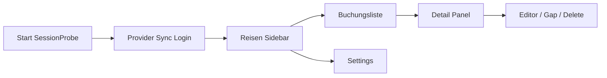

# HIG Core-UX Review (macOS, Discoverability)

**Datum:** 2026-07-20  
**Scope:** App-UI unter `Sources/Reisen` (macOS SwiftUI). Shared Domain/iOS-Targets ohne eigene UI.  
**Fokus:** Hints/Help, Kontextmenüs, Menü-/Command-Einträge, Empty States, Destructive Confirmations.  
**Nicht-Ziele:** Vollständige Accessibility-/VoiceOver-Audit (nur incidental Findings), visuelle Layout-Feinschliffe, Feature-Neuentwicklung.

## Kurzfazit

Die App hat bereits gute Ansätze (Mail-ähnliche 3-Spalten-Navigation, `ContentUnavailableView`, einzelne `.help`-Hints, Kontextmenüs an Reisen/Buchungszeilen, `confirmationDialog` für manuelles Buchungs-Löschen). Für macOS-HIG-Discoverability fehlen jedoch systematisch:

1. Menü-/Command-Abdeckung der Kernaktionen (aktuell fast nur Sync + Pasteboard)
2. Hover-Hints an vielen Toolbar-/Action-Buttons
3. Bestätigung bei destruktiven Aktionen (Reise löschen, von Reise entfernen, Store-Reset)
4. Handlungsfähige Empty States (CTAs statt nur Text)
5. Kontextmenüs an weiteren Listen (offene Buchungen, Provider-Zeilen)

## Evidence-Inventar (Ist-Zustand)

| Mechanismus | Vorkommen | Hauptdateien |
|-------------|-----------|--------------|
| `.help(...)` | ~10 Stellen | `ContentView`, `SyncView`, `ProviderSidebarRow` |
| `.contextMenu` | 3 Stellen | Sidebar-Reise, Sidebar-Buchung, Trip-Timeline |
| `.toolbar` | 4 Stellen | `ContentView`, `TripDetailView`, `SyncView`, `SaveProviderCredentialSheet` |
| `.commands` / `CommandGroup` | 1 Scene | `Reisen.swift` |
| `ContentUnavailableView` | 10+ | `ContentView`, `TripDetailView`, `SyncView`, `ProviderSyncContainer` |
| `confirmationDialog` | nur manuelles Buchungs-Löschen | `TripDetailView` |
| Undo (`NSUndoManager`) | keine UI-Nutzung | — |

### Vorhandene Menü-/Command-Einträge (`Reisen.swift`)

- Pasteboard: Ausschneiden/Kopieren/Einfügen/Alles auswählen
- `CommandGroup(replacing: .newItem) {}` — **leer** (unterdrückt „Neu“)
- App-Menü: „Provider Sync…“ (⌘1), „Alle Provider synchronisieren“ (⇧⌘R)
- Settings-Scene vorhanden

### Vorhandene Kontextmenüs

- **Reise (Sidebar):** Bearbeiten, Buchung hinzufügen…, Reise löschen (destruktiv, **ohne** Confirm)
- **Buchung (Sidebar, expanded):** Bearbeiten, Buchung hinzufügen… (kein Entfernen/Löschen)
- **Timeline (Trip Detail):** Bearbeiten, Buchung hinzufügen…, Browser öffnen, Von Reise entfernen (**ohne** Confirm), Löschen… (nur manual, **mit** Confirm); bei Gaps: Lücke bearbeiten…, Buchung hinzufügen…

---

## Findings (priorisiert)

### High

#### H1 — Destruktiv ohne Bestätigung: „Reise löschen“
- **Wo:** [`ContentView.swift`](../../../Sources/Reisen/App/ContentView.swift) Kontextmenü Sidebar (~Z. 367–372)
- **Problem:** `modelContext.delete(trip)` + `save()` sofort. HIG: destruktive Aktionen brauchen Confirm oder Undo.
- **Vorschlag:** `confirmationDialog`/`alert` mit Titel „Reise „…“ löschen?“ und klarem Hinweis auf Folgen (Zuordnung/Gaps). Optional Undo über SwiftData/NSUndoManager.

#### H2 — Destruktiv ohne Bestätigung: „Von Reise entfernen“
- **Wo:** [`TripDetailView.swift`](../../../Sources/Reisen/App/TripDetailView.swift) Kontextmenü (~432), Detail-Link (~1169), Summary-Pfad (~1717)
- **Problem:** Sofortiges `booking.trip = nil`. Inkonsistent zu „Löschen…“ (manual), das Confirm nutzt.
- **Vorschlag:** Einheitlich Confirm („Buchung von Reise entfernen?“). Im Kontextmenü `role: .destructive` setzen. Optional: Aktion auch in Sidebar-Buchungs-Kontextmenü.

#### H3 — App-Menü deckt Kernfunktionen nicht ab
- **Wo:** [`Reisen.swift`](../../../Sources/Reisen/Reisen.swift) `.commands` (~35–70)
- **Problem:** `replacing: .newItem` ist leer → kein „Neue Reise…“. Fehlend u. a.:
  - Datei/Ablage: Neue Reise…, Buchung hinzufügen…, Buchungen zuordnen…
  - Ansicht/Ablage: Provider Sync (bereits da), Sync aktueller Provider
  - Bearbeiten: Reise bearbeiten, Buchung bearbeiten (selektionsabhängig)
  - ggf. Fenster/Hilfe
- **Vorschlag:** `CommandGroup(replacing: .newItem)` mit „Neue Reise…“ (⌘N) füllen; weitere Commands über Notifications/FocusedValues an `ContentView`/`TripDetailView` anbinden (gleiches Pattern wie Sync).

#### H4 — Store-Reset ohne Bestätigung
- **Wo:** [`Reisen.swift`](../../../Sources/Reisen/Reisen.swift) `StoreFailureView` (~144)
- **Problem:** Prominent button löscht lokale DB ohne Confirm — maximal destruktiv.
- **Vorschlag:** Zweistufiger Dialog („Alle lokalen Daten unwiderruflich löschen?“).

### Medium

#### M1 — Hover-Hints fehlen an vielen Aktionen
- **Vorhanden:** Sync-all, Plus Reise, Expand, Keychain-Ausfüllen/Speichern, Ampel, Provider-Toggle
- **Fehlend (Beispiele):**
  - SyncView Toolbar „Buchungen synchronisieren“ / Action-Bar „Jetzt synchronisieren“ / „Browser anzeigen|ausblenden“
  - TripDetail Toolbar „Buchungen zuordnen…“, „Buchung hinzufügen…“
  - Detail-Links „Bearbeiten“, „Löschen…“, „Von Reise entfernen“
  - Sheet-Buttons ohne Text-Kontext (Icon-only falls später)
- **Vorschlag:** `.help` an allen Icon-/Kurzlabel-Controls und disabled-Zuständen (Warum disabled erklären, wie bei Keychain-Ausfüllen).

#### M2 — Empty States ohne nächste Schritte (CTAs)
- **Wo:** u. a. Willkommen, Keine offenen Buchungen, Keine Buchungen (Trip), Provider deaktiviert, Keine Storno-Infos
- **Problem:** Nur Beschreibung; HIG Empty States sollen Handlung anbieten.
- **Vorschläge:**
  - Willkommen / keine Reisen: Button „Neue Reise anlegen“ + „Provider Sync öffnen“
  - Keine Buchungen (Trip): „Buchung hinzufügen…“ / „Buchungen zuordnen…“
  - Provider deaktiviert: Fokus/Hinweis auf Sidebar-Checkbox (oder Inline-Toggle)
  - Offene Buchungen leer: „Provider synchronisieren“

#### M3 — Kontextmenüs unvollständig / inkonsistent
| Ort | Fehlt / Inkonsistenz |
|-----|----------------------|
| Offene Buchungen (Liste) | kein Kontextmenü (Zuordnen zu Reise…, Bearbeiten, Browser öffnen) |
| Sidebar-Buchung | kein „Von Reise entfernen“ / „Löschen…“ / Browser |
| Provider-Zeile | kein Kontextmenü (Sync jetzt, Aktivieren/Deaktivieren, Login öffnen) |
| Trip-Übersicht | Bearbeiten nur via Kontextmenü, kein Toolbar-/Menü-Pendant sichtbar |

#### M4 — Sheets: Cancel-Shortcut und Standard-Button-Labels uneinheitlich
- **Wo:** `TripEditorSheet`, `GapEditorSheet`, `AssignBookingsSheet` — nur `.defaultAction`, kein `.cancelAction` (im Gegensatz zu `BookingEditorForm`)
- **Labels:** „OK“ vs. „Sichern“ vs. „Zuordnen“ vs. „Speichern“
- **Vorschlag:** Überall Esc/`.cancelAction`; macOS-übliche Verben („Sichern“/„Abbrechen“ bei Editoren, „Zuordnen“ ok).

#### M5 — Toolbar-Discoverability Trip Detail
- Toolbar-Aktionen ohne `.help` und ohne Menü-Äquivalent; „Buchungen zuordnen…“ ist disabled ohne Erklärung, wenn keine Kandidaten.
- **Vorschlag:** `.help` mit disabled-Grund; Menüeintrag „Buchungen zuordnen…“.

### Low

#### L1 — Accessibility-Label widerspricht Aktion (Provider-Checkbox)
- **Wo:** [`ProviderSidebarRow.swift`](../../../Sources/Reisen/App/ProviderSidebarRow.swift) (~80)
- **Problem:** `.accessibilityLabel("… synchronisieren")`, Control toggelt aber Enable/Disable. `.help` ist korrekt.
- **Vorschlag:** Label = „\(name) aktivieren/deaktivieren“.

#### L2 — Settings-Footers gut, Vorlaufzeiten ohne Beispiel-Footer-Pattern
- Vorlauf-Section hat Inline-Hinweis, aber kein Footer wie die anderen Sections; kein `.help` am TextField.

#### L3 — Technische Detailfelder in Read-UI
- Offset-Sekunden in Booking-Detail wirken entwicklerorientiert; für Endnutzer ggf. ausblenden oder hinter „Erweitert“.

#### L4 — Doppelte Sync-Einstiege ohne klare Hierarchie
- Toolbar „Alle synchronisieren“, Menü ⇧⌘R, SyncView Toolbar ⌘R, Action-Bar „Jetzt synchronisieren“ — ok, aber Hints/Menütexte sollten „alle“ vs. „dieser Provider“ klar trennen (teilweise schon).

---

## Action-Matrix (Kernaktionen × Entry Points)

| Aktion | Toolbar | Menü/Command | Kontextmenü | Shortcut | Hint | Confirm |
|--------|---------|--------------|-------------|----------|------|---------|
| Alle Provider sync | ja | ja | — | ⇧⌘R | ja | n/a |
| Provider Sync öffnen | — | ja | — | ⌘1 | — | n/a |
| Sync aktueller Provider | ja (SyncView) | **nein** | **nein** | ⌘R | **nein** | n/a |
| Neue Reise | ja (+ / Section) | **nein** (newItem leer) | — | **nein** | ja | n/a |
| Reise bearbeiten | **nein** | **nein** | ja (Sidebar) | **nein** | — | n/a |
| Reise löschen | **nein** | **nein** | ja | — | — | **fehlt** |
| Buchung hinzufügen | ja (Trip) | **nein** | ja | **nein** | **teilw.** | n/a |
| Buchungen zuordnen | ja (Trip) | **nein** | **nein** | **nein** | **nein** | n/a |
| Buchung bearbeiten | Link Detail | **nein** | ja | **nein** | **nein** | n/a |
| Von Reise entfernen | Link Detail | **nein** | ja | — | **nein** | **fehlt** |
| Manual löschen | Link Detail | **nein** | ja | — | **nein** | ja |
| Browser öffnen | Link Detail | **nein** | ja (Timeline) | — | — | n/a |
| Provider en/dis | Sidebar | **nein** | **nein** | — | ja | n/a |
| Keychain ausfüllen | Sync banner | **nein** | — | — | ja | n/a |
| Settings | System | Settings-Scene | — | ⌘, (System) | Footers | n/a |

**Legende:** „—“ = nicht sinnvoll / nicht erwartet; Fett = Lücke.

---

## User-Journey-Abdeckung

| Journey | HIG-Status |
|---------|------------|
| Boot → Login/Sync | Gut (Banner, Keychain-Hints, Empty bei disabled). Menü führt zu Sync. |
| Sync → erste Reise | Welcome Empty ohne CTA; „Neue Reise“ nur Toolbar/Section-Plus, nicht Menü. |
| Trip → Buchungen | Toolbar + Kontextmenü gut; Hints/Menü fehlen. |
| Detail → Edit/Delete | Edit sichtbar; Remove/Delete-Confirm inkonsistent. |
| Offene Buchungen → zuordnen | Liste ohne Kontextmenü; Zuordnen nur in Trip-Toolbar. |
| Settings | Standard Settings-Scene + Footers ok. |

---

## Empfohlene Umsetzungsreihenfolge (ohne Scope-Creep)

1. **H1/H2/H4** — Confirmations für destruktive Aktionen (schnell, hohes Risiko)
2. **H3** — Menü: mindestens „Neue Reise…“ (⌘N), „Buchung hinzufügen…“, „Buchungen zuordnen…“, „Aktuellen Provider synchronisieren“
3. **M1** — `.help` an Toolbar-/Sync-/Detail-Actions inkl. disabled-Gründe
4. **M2** — CTAs in zentralen Empty States
5. **M3** — Kontextmenüs für offene Buchungen + Sidebar-Buchung angleichen
6. **M4/L1** — Sheet-Shortcuts + Accessibility-Label fix

## Abnahmekriterien (Review erledigt, wenn…)

- [ ] Jede destruktive Persistenz-Aktion hat Confirm oder dokumentiertes Undo
- [ ] Jede Kernaktion aus der Action-Matrix hat ≥2 Findability-Pfade (z. B. Toolbar + Menü oder Toolbar + Kontextmenü)
- [ ] Icon-only / kurze Labels haben `.help`
- [ ] Primäre Empty States bieten ≥1 CTA
- [ ] `CommandGroup(replacing: .newItem)` ist nicht leer

## Out of Scope (explizit später)

- Volles VoiceOver-/Keyboard-Navigation-Audit
- iOS/iPadOS-UI (laut README noch nicht vorhanden)
- Redesign Booking-Detail-Layout / technische Felder ausblenden (L3) als separates Spec
