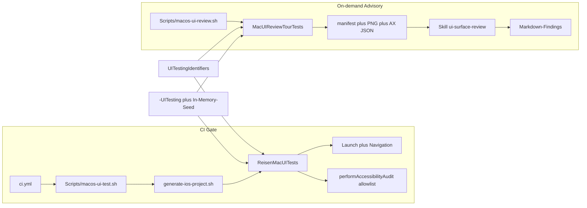

# macOS Oberflächen-Funktionstest (v1)

**Datum:** 2026-08-30  
**Status:** freigegeben (Plan-SSOT; zwei Review-Runden)  
**Plattform v1:** macOS (`ReisenMac` / Bundle-ID `de.reisen.Reisen`)  
**iOS:** eigene Folgespec; Identifier und Manifest-`schemaVersion` bleiben plattformneutral

Dieses Dokument ist der Implementierungsvertrag. Es spiegelt den freigegebenen Plan 1:1.

## Änderungsprotokoll

### Rev 0 — Brainstorming-Erstplan

Festgehalten und **unverändert gültig:**

- Hybrid: CI = Smoke + harte A11y; AI = on-demand, kein Merge-Gate.
- v1 nur macOS; iOS eigene Spec; Identifier/Manifest plattformneutral.
- Ansatz XCUITest + Cursor-Skill, nicht In-App-HTTP-Probe und nicht isolierte View-Hosting-Tests.
- Scripts-SSOT: `macos-ui-test.sh` / `macos-ui-review.sh`; `ci-test.sh` bleibt `swift test`.
- XcodeGen über bestehendes [`Scripts/generate-ios-project.sh`](../../../Scripts/generate-ios-project.sh).
- Target-Name `ReisenMacUITests` (nicht `ReisenSharedUITests`).
- AI-Rubrik: HIG / Unlogik / Design; deutsch; Severity; Evidence Pflicht.

### Rev 1 — Review (Isolation, Audit, CI-Betrieb)

Korrigiert, weil der Erstentwurf so **nicht fehlerfrei** war:

- **Store:** nicht `makeContainer()` + CloudKit-aus. UI-Test-App hat Bundle-ID `de.reisen.Reisen`; On-Disk würde den echten Store treffen. Pflicht: `makeInMemoryContainer()` bei `-UITesting`.
- **Prozessgrenzen:** `XCTestConfigurationFilePath` / Runner-`CI=true` gelten nicht in der App. Launch-Env `REISEN_CLOUDKIT=0` zusätzlich.
- **TCC:** `notificationEnabled` default true; `rebuildLocalSideEffects` und Cloud-Observer unter UI-Testing nicht starten.
- **Audit:** nicht ungefiltertes `performAccessibilityAudit()`. Allowlist; `.hitRegion` raus (44pt-iOS-Engine).
- **Queries:** Identifier, nicht L10n-Name. Page Objects. `-ApplePersistenceIgnoreState YES`.
- **Produkt unter Test:** XcodeGen-`ReisenMac` + XCTest, nicht SPM/`build-app.sh`/Swift Testing.
- **AX-Dump:** XCUI-Walk, nicht Accessibility-API (TCC).
- **CI:** Timeout 45; Signing analog `ios-test.sh`; AGENTS.md-SSOT; Sync-Tour ohne WebView-Wait.

### Rev 2 — weitere Fehler, Lücken, Folgespecs

Zusätzlich gefunden und **in den Vertrag aufgenommen:**

- **UserDefaults:** dieselbe Bundle-ID teilt `UserDefaults.standard` mit der installierten App. UI-Tests müssen eine **eigene Suite** nutzen, sonst werden lokale Settings (Kalender, Spaltenbreiten, Notifications) überschrieben.
- **Launch-UI:** bei `selection == nil` zeigt [`ContentView`](../../../Sources/Reisen/App/ContentView.swift) den **Provider-Session-Probe-Overlay** (ProgressView), nicht die Sidebar. Ohne Skip warten Smokes auf die falsche Fläche und können Netz/Keychain anfassen.
- **Destination:** kein hartes `arch=arm64` (bricht Intel-Hosts). `platform=macOS` bzw. `uname -m`.
- **CI-Logs:** `-resultBundlePath` + Artifact bei Fehlschlag (sonst rotes CI ohne XCUI-Trace).
- **Manifest:** `schemaVersion` für spätere iOS-Adapter.
- **Review-Dir:** Default gitignore/`/tmp`, nicht committen.
- **Hit-Targets (Best Practice):** nicht Apples 44pt in CI. Folgespec: eigene macOS-Heuristik (interaktive XCUI-Elemente, Mindestframe 20pt) als CI-Gate, **nach** stabilem v1-Baseline. Bis dahin nur AI-Review.

## Ziel

Zwei getrennte Pfade, eine Harness:

- **CI-Gate:** App startet, Kernnavigation mit Fixture-Daten, gezieltes `performAccessibilityAudit(for:)` — rot bei Launch-/Nav-Bruch oder Allowlist-A11y-Verstößen.
- **On-demand (advisory):** erweiterte XCUI-Tour schreibt Screenshot + AX-Dump; Cursor-Skill bewertet HIG, Unlogik, Design. **Kein CI-Fail.**

v1-CI ist **Smoke + harte A11y**, kein voller Funktionstest (kein Create/Delete/Sync-Erfolg).

## Architektur

- `swift test` / [`Scripts/ci-test.sh`](../../../Scripts/ci-test.sh) unverändert.
- UI-Tests: **XCTest**, XcodeGen-only, **nicht** in `Package.swift`.
- Host: **ReisenMac**, nicht SPM-`.app` aus [`Scripts/build-app.sh`](../../../Scripts/build-app.sh).
- Generate-Skript bleibt [`Scripts/generate-ios-project.sh`](../../../Scripts/generate-ios-project.sh). Rename ist nicht v1.

## Isolation — Vertrag

UI-Test-App = eigener Prozess, Bundle-ID `de.reisen.Reisen`. Bei `-UITesting` / `-UITestingEmpty`:

1. `AppBootstrap` nur `makeInMemoryContainer()` — nie `makeContainer()`.
2. Launch-Env `REISEN_CLOUDKIT=0`.
3. Keine EventKit-/Notification-Side-Effects: kein `rebuildLocalSideEffects`, kein Cloud-Observer.
4. **Isolierte UserDefaults-Suite** (nicht `UserDefaults.standard` der Produktiv-App). AppStorage-Keys lesen/schreiben nur diese Suite.
5. **Session-Probe überspringen:** Overlay nicht zeigen, `sessionProbeFinished` sofort, kein Provider-/Keychain-Netz.
6. Launch-Args: `-ApplePersistenceIgnoreState YES`.
7. Seed nur bei `-UITesting`. Queries über stabile Identifier (UUID-Konstante), nicht L10n-Titel.

## Komponenten

- **Identifier-SSOT:** `UITestingIdentifiers` in `ReisenSharedUI`. Anwendung: macOS-Chrome in [`Sources/Reisen`](../../../Sources/Reisen), Inspector in SharedUI. VoiceOver-Labels bleiben L10n.
- **Target:** `ReisenMacUITests` (`bundle.ui-testing`) in [`project.yml`](../../../project.yml); Scheme `ReisenMac` bekommt `test:`. Host `ReisenMac`.
- **Page Objects:** `Tests/ReisenMacUITests/MacUI.swift`.
- **CI-Script:** [`Scripts/macos-ui-test.sh`](../../../Scripts/macos-ui-test.sh): Generate, dann `xcodebuild test -scheme ReisenMac -destination 'platform=macOS' -only-testing:ReisenMacUITests -resultBundlePath …`. Token-Stub wie iOS. CI-Signing: `CODE_SIGNING_ALLOWED=NO`; wenn Attach an die Sandbox-App scheitert: Ad-hoc `CODE_SIGN_IDENTITY=-`, kein Skip.
- **CI-Wiring:** Step in [`.github/workflows/ci.yml`](../../../.github/workflows/ci.yml) nach iOS-Tests. **Timeout 45.** Bei Fehlschlag xcresult als Artifact. [`AGENTS.md`](../../../AGENTS.md): `bash ./Scripts/macos-ui-test.sh`.
- **Review-Script:** `REISEN_UI_REVIEW=1`, `$REISEN_UI_REVIEW_DIR` (Default `/tmp` oder gitignored `DerivedData/ui-review`). Tour per `XCTSkipUnless`.
- **Skill + Rubrik:** [`.cursor/skills/ui-surface-review/SKILL.md`](../../../.cursor/skills/ui-surface-review/SKILL.md), [`docs/qa/ui-review-rubric.md`](../../qa/ui-review-rubric.md).

## CI-Journeys (Gate)

`continueAfterFailure = false`. Waits auf Identifier/Fenster, kein Sleep.

1. Launch: Hauptfenster, Sidebar-Identifier (nach übersprungener Probe).
2. Geseedete Reise per Identifier, Detail/Timeline sichtbar.
3. Buchungszeile öffnet Inspector.
4. Accessibility-Audit mit Allowlist.

## Accessibility-Audit (CI)

`performAccessibilityAudit(for:issueHandler:)`. **Nicht** ungefiltert.

**Allowlist v1:** `.sufficientElementDescription`, `.elementDetection`, `.action`, `.parentChild`.

**Nicht v1-CI:** `.hitRegion` (44pt), `.contrast`, `.dynamicType`, `.textClipped`, `.trait` — erst nach Baseline-False-Positive-Messung.

Skips nur in `Tests/ReisenMacUITests/AccessibilityAuditSkipList.swift` (Identifier + Typ + Begründung).

## On-demand-Tour (kein Gate)

Settings (⌘, / Identifier), Sync-Chrome ohne WebView-Wait, Booking-Editor, destruktiver Dialog (öffnen, nicht bestätigen), Empty State (`-UITestingEmpty`).

Artifacts: `manifest.json` mit `schemaVersion`, PNG aus `XCUIApplication.screenshot()`, AX-JSON aus XCUI-Walk (identifier, label, elementType, frame, enabled, hittable). Kein TCC, kein `debugDescription`-Parse.

## AI-Rubrik (advisory)

HIG (macOS, inkl. [`docs/superpowers/specs/2026-07-20-hig-core-ux-review.md`](2026-07-20-hig-core-ux-review.md)) / Unlogik / Design. Deutsch, blocker/major/minor/nit, Screenshot+AX Pflicht. Kein Score, kein Merge-Gate. Fehlende Dumps oder fehlendes Modell: Abbruch, keine erfundenen Screens.

## Fehlerbehandlung

- Launch/Store-Fehler: `XCTFail`, kein Skip.
- Nie Nutzer-CloudKit-, Application-Support-Store oder Produktiv-UserDefaults.
- Signing-/Attach-Fehler: Script-Exit ungleich 0.
- Skill ohne Artifacts: Abbruch.

## Restlücken (bewusst, kein v1-Bug)

Diese Punkte sind **nicht vergessen**, sondern außerhalb von v1. Ein Implementierer darf sie nicht still in v1 ziehen.

- **Funktionstiefe:** CI prüft nicht Create-Reise, Löschen-Confirm, Paste-Import, Settings-Persistenz, Sync-Erfolg.
- **iOS / iPad / ReiseniOSPrivate:** kein Simulator-XCUI, kein zweites Host-Target.
- **Visuell:** kein Pixel-Snapshot, keine Light/Dark-Pflicht, keine feste Locale/Appearance im CI.
- **A11y-Breite:** kein VoiceOver-Durchlauf; Contrast/Dynamic Type/Text Clipped/Trait nicht im Gate; Apples Hit-Region nicht im Gate.
- **HIG als Code:** Menü-Abdeckung, Empty-State-CTAs, destruktive Confirms sind AI + bestehende Unit-Tests, kein XCUI-Assert.
- **Daten/Netz:** keine echten Provider, kein WebView-Inhalt, Keychain nur dadurch vermieden, dass die Probe skippt.
- **Betrieb:** Suite-Jobs dürfen parallel laufen; Merge-Gate bleibt ein Aggregator-Check **`CI`** (siehe [`../plans/2026-09-02-reisen-ci-performance.md`](../plans/2026-09-02-reisen-ci-performance.md)). 45 min Timeout gilt pro Suite-Job.
- **Generate-Skript-Name** bleibt iOS-lastig.
- **Crash-Reporter:** `GitHubIssueCrashCatcher` bleibt installiert; Token ist leer — kein Extra-Gate.
- **Skill-Modell:** welches lokale/Cursor-Modell läuft, ist nicht festgelegt (Cursor-Session).

## Künftige Erweiterungen (empfohlene Reihenfolge)

1. **iOS-Adapter-Spec:** `ReiseniOSUITests` + `ios-ui-test.sh`/`ios-ui-review.sh`, gleiches Manifest `schemaVersion`, gleiche Identifier wo SharedUI. Private-App getrennt oder `IOS_SCHEME`.
2. **macOS-Hit-Target-CI:** nach v1-Baseline eigene Heuristik (interaktive Elemente, Mindestframe **20pt**, nicht 44pt). Das ist die Best-Practice-Erfüllung des ursprünglichen Hit-Target-Wunsches.
3. **Funktionelle XCUI-Smokes:** Neue Reise via Command, Delete-Dialog erscheint (nicht ausführen), Inspector-Feld der Seed-Buchung sichtbar.
4. **Audit-Ausweitung:** `.contrast` / `.trait` nach gemessener False-Positive-Rate; dokumentierte Skips.
5. **Appearance-Tour:** Light und Dark, feste Locale (`en`+`de` optional) im Review-Dump.
6. **Pixel-Regression:** nur on-demand oder Nightly, nicht PR-Gate, bis Identifier-Stabilität da ist.
7. **Kodierte HIG-Regeln:** Menü „Neue Reise“, Empty-State-CTA, Confirm bei Trip-Delete — als XCUI, sobald die Produkt-UI das herstellt (heute laut HIG-Spec teilweise fehlend; Tests würden rot ohne Produktfix).
8. **CI-Split:** eigener Job für macOS-UI, wenn Timeout 45 nicht hält.
9. **Rename** `generate-ios-project.sh` → `generate-xcode-project.sh` (rein dokumentarisch/SSOT-Name).
10. **Paste-Import-Fenster** und Provider-Sync-Happy-Path in die Tour, sobald Fixtures ohne Netz reichen.

Punkt 7 nicht vor Produkt-HIG-Fixes als Gate schalten — sonst testet CI absichtlich den bekannten Spec-Ist.

## Reihenfolge nach Spec-Commit

1. Isolation: In-Memory, UserDefaults-Suite, Probe-Skip, Side-Effect-Skip, Seed+Empty, Identifier.
2. XCUI Smokes + Audit-Allowlist + Script + xcresult + CI-Timeout/AGENTS.md.
3. Review-Tour + Manifest `schemaVersion` + Review-Script.
4. Rubrik + Skill, Probe mit echtem Dump.

## Self-Review

- Vertrag trennt CI-Gate und advisory Tour; keine dritte Architektur (kein AX-HTTP-Harness in v1).
- Isolation deckt Store, UserDefaults, Probe, Side-Effects und Queries ab.
- Restlücken und Folgespecs sind explizit; v1 zieht sie nicht still nach.
- Offene Folgespec: iOS-Adapter, macOS-Hit-Target-CI, funktionelle Smokes.
