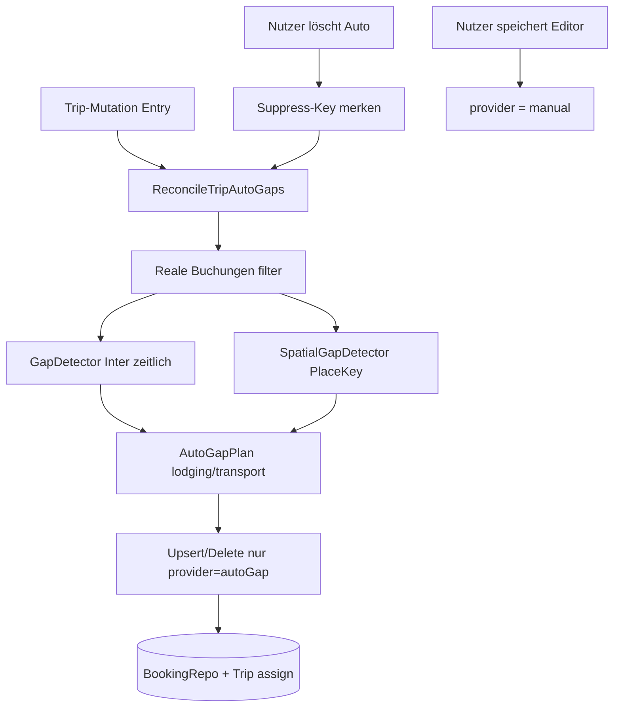

# Auto-Gap-Fill bei Reiseänderungen — Design

**Datum:** 2026-09-01  
**Status:** Spec (feature-dev P1)  
**Worktree:** `.worktrees/feat-auto-gap-fill-on-trip-change`

## Intent

Bei **jeder Änderung der Zusammensetzung einer Reise** („Reisen“-Eintrag) soll ein Domain-Algorithmus

1. **zeitliche Lücken** erkennen → Bedarf **Unterkunft** (`hotel`),
2. **räumliche Lücken** erkennen → Bedarf **Transport** (`flight` / `train` / `ferry`; Bus siehe Restlücken),

und daraus **automatische Buchungs-Einträge** anlegen bzw. **nur diese** automatisch erzeugten Einträge anpassen oder entfernen. Manuelle und Sync-Buchungen werden nie still überschrieben.

Optional genannt: **Apple Intelligence** bei Unklarheiten (Ortsgleichheit, Transportmodus) — in v1 **nicht** produktiv; Folgespec.

## Ist-Zustand (Repo)

| Baustein | Rolle heute |
| --- | --- |
| `GapDetector` / `GapAssembly` / `GapEdgeBuilder` | Zeitlücken ≥ `defaultMinGap` (12 h) zwischen Buchungen + Trip-Ränder |
| `GapKindClassifier` | Heuristik aus angrenzenden `BookingType` → `lodging` / `transport` / `both` |
| `ComputedGap` + `SDGap` | Timeline-Anzeige + optionale Nutzer-Metadaten (Titel/Preis), **keine** Buchung |
| `TripCompleteness` | Zählt Inter-Lücken auf **nicht-stornierten** Buchungen |
| `GapContext` Hints | Deep-Link-Suche (Hotel/Flug) aus Nachbar-Locations |
| `ProviderID.manual` | Nutzer-Buchungen; Sync ersetzt sie nicht |

**Lücke zum Intent:** Keine Persistenz automatischer Platzhalter-Buchungen; keine **ort-/zeitzonenbasierte** Transport-Erkennung unabhängig von `minGap`; kein Reconcile nach Mutation.

## Begriffe (SSOT)

| Begriff | Bedeutung |
| --- | --- |
| **Reale Buchung** | Jede Buchung mit `provider != .autoGap` und `status != .cancelled` |
| **Auto-Gap-Eintrag** | Buchung mit `provider == .autoGap`; vom Reconciler verwaltet |
| **Zeitliche Lücke** | Intervall ≥ `GapDetector.defaultMinGap` zwischen Ende und Start zweier aufeinanderfolgender realer Buchungen im Trip-Fenster (bestehende Inter-Logik; Rand-Gaps **ohne** Auto-Fill in v1) |
| **Räumliche Lücke** | Ortsschlüssel am Ende der vorherigen realen Buchung ≠ Ortsschlüssel am Anfang der nächsten — **unabhängig** von `minGap` |
| **Ortsschlüssel (`PlaceKey`)** | Deterministische Normalisierung (Trim, Casefold). **IATA:** wenn der gesamte String nach Trim genau 3 Buchstaben ist **oder** ein Parenthese-Token `(XXX)` mit 3 Buchstaben vorkommt → Uppercase-IATA als Key; sonst casefold des ganzen Strings. Leerer Key → **keine** räumliche Aussage (kein stiller Default-Ort) |
| **Zeitzonen-Hinweis** | Unterschiedliche gesetzte Flug-/Fähren-Offsets (`flightDepartureOffsetSeconds` / `flightArrivalOffsetSeconds`) der Nachbarn → bevorzugt `.flight` als Transporttyp; allein ohne Ortshinweis **kein** Auto-Transport |
| **Reconcile** | Idempotenter Use-Case: Detect auf realen Buchungen → gewünschte Auto-Menge → Upsert/Delete **nur** Auto-Gap-Einträge |
| **Auto-Identity-Key / Suppress-Key** | **Zeitstabil:** `fromBookingID|toBookingID|role` mit `role` ∈ `{lodging,transport}`. **Keine** Epochs im Key (sonst bricht Update/Suppress bei Zeitanpassung). Zeiten/Orte/Typ sind Upsert-Felder, nicht Key-Bestandteil. Nach Nutzer-Löschung: Suppress dieses Keys |
| **autoGapIdentityKey** | Dediziertes optionales Buchungsfeld (Domain + SwiftData); **nicht** `confirmationCode` / Fingerprints überladen |
| **Promotion** | Nutzer speichert Auto-Eintrag im Editor → `provider` wird `.manual`, `autoGapIdentityKey` wird geleert; Eintrag fällt aus dem Reconcile |

## Verworfene Alternativen

### A — Nur `SDGap` auto-persistieren (verworfen)

Pros: Wenig Schema-Risiko.  
Cons: Kein „Eintrag“ in der Buchungsliste; Completeness/Timeline bleiben Gap-UI; passt schlecht zu „automatische Einträge anpassen“.

### B — Soft-Trips / zweites Persistenzmodell (verworfen)

Pros: Klare Trennung.  
Cons: Parallel-Architektur zu `Booking`; Sync/UI/CloudKit-Duplikation.

### C — Empfohlen: Auto-Gap-Buchungen (`ProviderID.autoGap`)

Pros: Nutzt bestehende Timeline/Editor/Zuordnung; klare Filterregel; Sync ignoriert sie wie Manual-Außerhalb-Katalog; nur Auto wird reconciled.  
Cons: Completeness muss Auto explizit ausschließen; UI braucht Herkunfts-Badge.

## Architektur

### Schichten

| Schicht | Verantwortung |
| --- | --- |
| `ReisenDomain` | `PlaceKey`, `SpatialGapDetector`, `AutoGapPlan` / `ReconcileTripAutoGaps`, Erweiterung `ProviderID.autoGap`, Completeness-Filter |
| `ReisenData` | Persistenz Auto-Buchungen; Suppress-Store (Trip-gebunden oder dedizierte Entity — eine SSOT) |
| `ReisenAppCore` / App-Hosts | **Ein** Hook nach allen Trip-Kompositionsänderungen (Assign, Booking save/delete/status, Sync-Assignment, Trip-Datumsänderung) |
| `ReisenSharedUI` | Badge/Label „Automatisch“ an Auto-Einträgen; Löschen → Suppress; Speichern → Promotion |

Keine Parallel-Timeline. `ComputedGap` bleibt für **verbleibende** Lücken zwischen **allen** angezeigten Buchungen (inkl. Auto) bzw. Completeness weiter nur auf realen — siehe Semantik unten.

## Erkennungsregeln (v1, deterministisch)

Eingabe: chronologisch sortierte **reale** Buchungen der Reise (Trip-Fenster wie `GapTripWindow` / Completeness).

### 1. Zeitlich → Unterkunft

- Inter-Booking-Zeitlücke ≥ `GapDetector.defaultMinGap`.
- Gewünschter Typ: `hotel`, wenn `GapKindClassifier` `.lodging` oder `.both` liefert; bei reinem `.transport` **kein** Hotel-Auto aus der Zeitregel (räumliche Regel kann trotzdem Transport erzeugen).
- Zeitraum: `gapStart`/`gapEnd` der berechneten Lücke.
- Orte: `locationFrom`/`locationTo` aus `GapContext`-Hints (destination), sofern vorhanden; sonst Felder leer lassen (kein Dummy-Ort).

### 2. Räumlich → Transport

**Ortsextraktion (SSOT, analog `GapContext`-Hints):**

- Ende der vorherigen Buchung (`fromEndPlace`): erste nicht-leere normalisierbare Quelle in Reihenfolge `locationTo` → `locationToAddress` → `locationFrom` → `locationFromAddress`
- Start der nächsten Buchung (`toStartPlace`): `locationFrom` → `locationFromAddress` → `locationTo` → `locationToAddress`

- Ungleiche nicht-leere `PlaceKey`s → Transportbedarf.
- Beide Keys leer → **kein** räumliches Auto (fehlende Daten sichtbar, kein Raten).
- Ein Key leer, einer gesetzt → **kein** Auto (unklar); optional später Apple Intelligence (open_gaps).
- Typ-Wahl v1 (deterministisch, ohne KI):
  - mind. eine Nachbarbuchung `flight` **oder** Zeitzonen-Hinweis: `from.flightArrivalOffsetSeconds` und `to.flightDepartureOffsetSeconds` beide non-nil und ungleich → `.flight`
  - sonst wenn Nachbar `ferry` → `.ferry`
  - sonst → `.train` (Bus siehe Restlücken; kein stilles `.other` als Transport-Attrappe)
- Zeiten: Start = Ende vorherige, Ende = Start nächste (auch wenn Dauer &lt; 12 h). Sehr kurze Dauern (&lt; 15 min) nur anlegen wenn Ortskeys klar differieren (Umstiegssignal).

### 3. Überlapp / Doppelpläne

- Pro Paar `(from,to)` höchstens **ein** Auto-Hotel (`role=lodging`) und **ein** Auto-Transport (`role=transport`), wenn beide Regeln greifen.
- Identity/Suppress: `fromID|toID|lodging` bzw. `fromID|toID|transport` — **ohne** Epochs. `ComputedGap.identityKey` bleibt UI/Persistenz-SSOT für Gap-Metadaten und ist **nicht** derselbe String.

### 4. Was Reconcile tut

| Situation | Aktion |
| --- | --- |
| Geplanter Key neu | Insert Auto-Booking (`autoGapIdentityKey` = Key) + Trip-Assign |
| Geplanter Key existiert (Match über `autoGapIdentityKey`) | Zeiten/Orte/Typ/Titel-Default aktualisieren **nur** wenn `provider == .autoGap` |
| Auto existiert, Key fehlt im Plan | Delete (außer Suppress) |
| Key in Suppress-Menge | Nicht anlegen |
| `provider == .manual` / Sync-Provider | Nie ändern/löschen durch Reconcile; Sync-Katalog ignoriert `autoGap` |

**User-touched:** Promotion zu `.manual` oder Suppress nach Delete. Fein-Flag „Felder manuell überschrieben aber noch autoGap“ ist YAGNI — Promotion beim Speichern reicht.

**Trip-Reassign:** Wenn eine reale Buchung von Trip A nach Trip B (oder `nil`) wechselt, Reconcile **beide** betroffenen Trip-IDs (Alter und Neuer); bei `nil` nur Alter. Sonst Orphan-Autos auf A.

### 5. Completeness & Gap-UI

- `TripCompletenessCalculator` und Detect für Auto-Plan arbeiten nur auf **realen** Buchungen.
- Auto-Einträge machen die Reise **nicht** „timeline complete“.
- Timeline zeigt Auto-Einträge wie Buchungen (mit Badge); verbleibende `ComputedGap` zwischen gemischter Liste sind ok, solange Completeness-SSOT real bleibt.

### 6. Trigger (Entry)

SSOT-API: `AutoGapReconcileTrigger.run(tripIDs: Set<UUID>)` (leere Menge = no-op).

Konkrete Mutationspfade (Supply):

| Pfad | tripIDs |
| --- | --- |
| `SwiftDataTripRepository.assignBooking(bookingID:toTripID:)` | alter `tripID` der Buchung (falls vorhanden) ∪ neuer `toTripID` (falls nicht nil) |
| Booking upsert/delete (Data-Repos / Editor-Save) mit `tripID` | dieses `tripID` |
| Status → `cancelled` einer Trip-Buchung | deren `tripID` |
| Sync-Assignment / Feld-Update realer Trip-Buchungen | betroffene Trip-ID(s) |
| Trip `startDate`/`endDate` upsert | dieses Trip-`id` |

Kein Polling; ein Aufruf nach abgeschlossener Mutation.

## Apple Intelligence

v1: **kein** produktiver Aufruf und **kein** Inventar-`adapter`. Bestehendes `FoundationModels*`-Muster (Paste-Import) ist Vorbild für eine Folgespec:

- Disambiguierung `München`/`Munich`/`MUC`
- Transportmodus Bus vs. Bahn vs. Flug bei Ambivalenz

v1 Place-Evidence = `placekey-contract` / Normalize-Tests; AI nur in Restlücken/`open_gaps`.

## UI (minimal)

- Badge/Caption „Automatisch“ (L10n) an Auto-Gap-Einträgen.
- Löschen: **zuerst** Suppress-Key schreiben, **dann** Booking löschen, **dann** `AutoGapReconcileTrigger.run` — sonst legt Reconcile denselben Key sofort neu an (HIG-Confirm wenn destruktiv).
- Editor-Speichern → Promotion zu manual (bestehende Manual-Editor-Pfade).
- Keine neue Gap-Sheet-Pflicht; Deep-Links bleiben für echte Gaps nutzbar.

## Schnittstellen-Inventar

| id | kind | supply | evidence |
| --- | --- | --- | --- |
| trip-mutation-entry | entry | `AutoGapReconcileTrigger.run` an assign (Dual-Trip), Booking CRUD/Status, Trip-Daten, Sync-Assignment | Hook-/Repo-Test inkl. A→B Reassign |
| auto-gap-booking-contract | contract | Planner + Diff + `autoGapIdentityKey` Match/Suppress | Domain-Tests |
| suppress-store-contract | contract | Persistenz Suppress-Keys pro Trip | Data-Test |
| placekey-contract | contract | `PlaceKey.normalize` inkl. `(MUC)`-Token | Domain-Tests |
| gap-detector-neighbor | neighbor | Zeitliche Inter-Lücken SSOT | GapDetector-Tests |
| gap-kind-classifier-neighbor | neighbor | Lodging nur bei Classifier `.lodging`/`.both` | Classifier + Planner-Tests |
| completeness-neighbor | neighbor | Completeness nur `isRealForGapDetect` | TripCompletenessTests |
| sync-autogap-neighbor | neighbor | Sync-Katalog/`deleteProviderBookings` fasst `autoGap` nicht an | Test oder Assert in Sync-Filter |
| cloudkit-autogap-schema | capability | `autoGapIdentityKey` + Suppress-Entity in SwiftData/CloudKit-Modelliste | Schema-Assert; CloudKit-Feldreview → open_gaps bis Review |

**Kein** `port-only`: Entry ist liefernd. Apple-Intelligence-`adapter` bewusst **nicht** im v1-Inventar (nur Restlücken).

## Restlücken / Folgespecs

1. Apple Intelligence / FoundationModels für Place- und Modus-Disambiguierung  
2. `BookingType.bus` (oder explizite Produktentscheidung Bus≡Bahn)  
3. Leading/Trailing Trip-Rand mit Auto-Fill  
4. XCUI Badge / Suppress-Journey  
5. CloudKit-Feldliste für `autoGap` + Suppress-Entity Review  

## Akzeptanz (v1)

1. **Flug → Hotel → Flug**, Hotel auf `cancelled`: zwischen den beiden Flügen entsteht zeitliche `.lodging`-Lücke → Auto-Hotel; Sync-/Manual-Buchungen unverändert. (Hotel als Nachbar zu Flug allein erzeugt laut `GapKindClassifier` **kein** Lodging-Auto.)  
2. Zwei Hotels unterschiedliche Städte, kurze Zeitlücke → Auto-Transport mit korrektem Typ laut Regeln.  
3. Ort/Offsets einer realen Buchung ändern → bestehender Auto-Eintrag **derselbe Identity-Key** wird aktualisiert (kein Delete+Insert-Flicker); Suppress bleibt gültig.  
4. Auto löschen → erscheint nach weiterem Reconcile nicht erneut (Suppress auf zeitstabilem Key).  
5. Auto im Editor speichern → Promotion zu manual (`autoGapIdentityKey` leer) und Reconcile ändert/löscht sie nicht mehr.  
6. Completeness bleibt unvollständig, solange reale Inter-Lücken existieren — auch wenn Auto-Platzhalter sichtbar sind.  
7. Reale Buchung von Trip A nach Trip B verschieben → Reconcile A und B; keine Orphan-Autos auf A.
